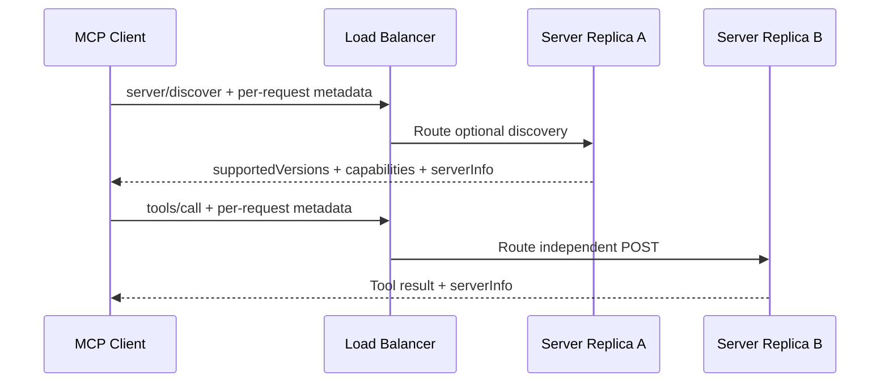
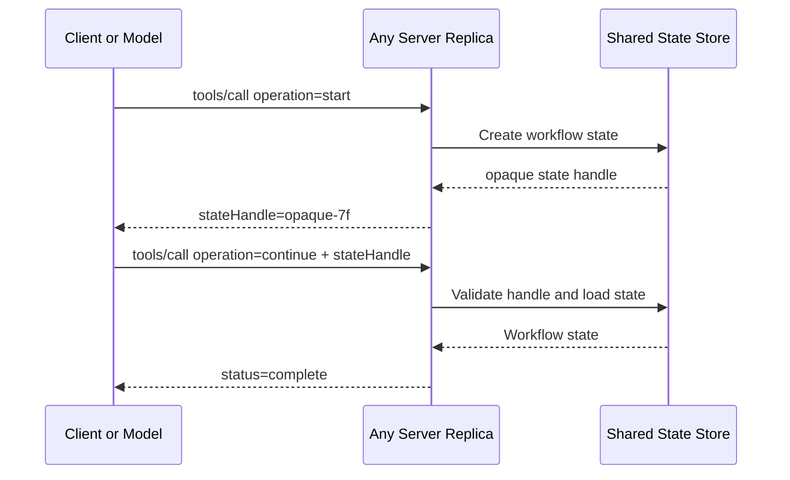

# Stateless MCP 與 Sessionless HTTP

本章對應 [SEP-2575: Make MCP Stateless](https://modelcontextprotocol.io/seps/2575-stateless-mcp) 與 [SEP-2567: Sessionless MCP via Explicit State Handles](https://modelcontextprotocol.io/seps/2567-sessionless-mcp)。兩個 SEP 解決不同層次的隱含狀態：SEP-2575 移除 initialization handshake，SEP-2567 再移除 protocol-level session 與 `Mcp-Session-Id`。

## 為什麼要改

舊流程要求 client 先送 `initialize`／`notifications/initialized`，server 把 protocol version、client capabilities 等資料留在 session，後續 request 必須回到同一個 server instance。這會造成 sticky routing、session replication、連線恢復及故障轉移的額外成本。

`2026-07-28` 改成每個 request 自我描述：



這裡有一個容易混淆的規範邊界：

- server **MUST** 實作 `server/discover`，回報 supported versions、capabilities 與 identity。
- client **MAY** 在第一個業務 request 前呼叫 discovery；它不是 protocol handshake，也不是其他 request 的前置條件。
- go-sdk v1.7.0 的 `Client.Connect` 會先嘗試 `server/discover`，若對方是舊 peer 或 discovery 失敗，再 fallback 到 legacy `initialize`。

因此「client 可省略 discovery」與「server 必須支援 discovery」並不矛盾。

## 每個 request 與 result 帶什麼

新協定 request 的 `params._meta` 帶有：

| Key | 規範語意 | Go handler 讀取方式 |
| --- | --- | --- |
| `io.modelcontextprotocol/protocolVersion` | required protocol version | `req.ProtocolVersion()` |
| `io.modelcontextprotocol/clientCapabilities` | required client capabilities | `req.ClientCapabilities()` |
| `io.modelcontextprotocol/clientInfo` | client **SHOULD** 提供的 identity | `req.ClientInfo()` |

server 也 **SHOULD** 在每個 result 的 `_meta.io.modelcontextprotocol/serverInfo` 表明 identity。go-sdk 會自動注入上述 request metadata 與 result `serverInfo`；應用程式不應手動拼 wire JSON。本章 tool handler 實際讀取三個 request helper，client 則從 `CallToolResult.GetMeta()` 驗證 `mcp.MetaKeyServerInfo`。

簡化後的 tool request 如下：

```json
{
  "jsonrpc": "2.0",
  "id": 2,
  "method": "tools/call",
  "params": {
    "name": "echo",
    "arguments": { "message": "hello" },
    "_meta": {
      "io.modelcontextprotocol/protocolVersion": "2026-07-28",
      "io.modelcontextprotocol/clientInfo": {
        "name": "stateless-client",
        "version": "1.0.0"
      },
      "io.modelcontextprotocol/clientCapabilities": {}
    }
  }
}
```

## Go SDK 對照

server 最重要的設定是：

```go
handler := mcp.NewStreamableHTTPHandler(
    func(*http.Request) *mcp.Server { return server },
    &mcp.StreamableHTTPOptions{
        Stateless:    true,
        JSONResponse: true,
    },
)
```

`Stateless: true` 有下列可觀察行為：

- protocol `2026-07-28` 可以在 Streamable HTTP 上被選用。
- 每個 POST 建立短生命週期 transport/session 來處理該 request。
- server 不讀也不寫 `Mcp-Session-Id`。
- standalone GET 與 DELETE 回覆 `405 Method Not Allowed`。
- `ping` 在新 revision 已移除，modern request 會得到 `MethodNotFound`。
- SSE resumability、event ID／`Last-Event-ID` redelivery 已移除。

若 response stream 在 request 完成前中斷，該 in-flight request 已遺失；client **MUST** 用新的 JSON-RPC request ID 重新送出，而不是嘗試 resume。這也表示可能有副作用的 operation 必須設計 idempotency key 或可查詢的 explicit state handle，不能只依賴 transport request ID 去重。

如果新 request 帶了不支援的 version，server 回 `UnsupportedProtocolVersion`（`-32022`），其 structured `data` 包含 `requested` 與 `supported`。本章以 raw HTTP request 驗證 status、error code 與 supported version array，不比對不穩定的完整錯誤文字。

## 執行

在 repository 根目錄執行：

```bash
go run ./01-stateless-sessionless
```

輸出重點如下；POST 數量可能因 discovery、tool call 與 raw error fixture 而不同：

```text
negotiated protocol: 2026-07-28
client session ID: ""
tool result: hello, stateless MCP
per-request metadata: protocol=2026-07-28 client=stateless-client capabilities-present=true
result serverInfo present: true
GET status: 405
DELETE status: 405
unsupported protocol: status=400 code=-32022 requested=2099-01-01 supported=...
...
independent POST requests: 3; any session header: false
```

執行測試：

```bash
go test ./01-stateless-sessionless -v
```

測試除了 tool result，也斷言 negotiated version、request metadata、result `serverInfo`、空 session ID、GET/DELETE 405、沒有 session header，以及 unsupported-version structured error。

## 需要跨 request 狀態怎麼辦

Sessionless 不等於應用程式不能保存狀態，而是狀態關聯必須明確。推薦流程是 server 建立不可猜測的 handle，將它放進 tool result；client/model 在下一次 tool arguments 原樣帶回。任一 replica 都能以 handle 到 shared store 取回應用程式狀態。



「任一 request 可到任一 replica，protocol 不需共享 session storage」不代表 application state 自動消失。上圖的 workflow state 仍可能需要 shared durable store；差別在於 lookup key 是明確、可授權的 handle，而不是 transport 暗藏的 session identity。可執行的 replacement pattern 也可參考 [`06-deprecated-features`](../06-deprecated-features/)。

handle 是不受信任的 client input。server 應驗證格式、authorization／tenant binding、期限與 replay；若 handle 自帶狀態，必須簽章或加密。不要把機密資料、裸 database primary key 或可偽造的 user ID 當 handle。

## 常見錯誤

- 忘記 `Stateless: true`：modern HTTP client 無法使用 `2026-07-28`，通常會協商降版。
- 把 `server/discover` 當成不可省略的 handshake。
- 仍依賴 `ServerSession` 保存 business state：下一個 POST 不保證取得相同 session object。
- 以為 `session.ID()` 空值是 bug：在 sessionless protocol 中這正是預期結果。
- stream 中斷後沿用舊 JSON-RPC ID，或假設 `Last-Event-ID` 會補送。
- 在 load balancer 保留 sticky session：通常已不再必要，但 authentication、rate limiting 或應用程式 state store 仍需獨立設計。
- 使用 `MCPGODEBUG=allowsessionsinstateless=1` 當永久方案：它只為升級緩衝，預計在 go-sdk v1.9.0 移除。

## 延伸閱讀

- [2026-07-28 release blog：No handshake or sessions](https://blog.modelcontextprotocol.io/posts/2026-07-28/#no-handshake-or-sessions)
- [2026-07-28 changelog](https://modelcontextprotocol.io/specification/2026-07-28/changelog)
- [SEP-2575 原文](https://modelcontextprotocol.io/seps/2575-stateless-mcp)
- [SEP-2567 原文](https://modelcontextprotocol.io/seps/2567-sessionless-mcp)
- [go-sdk v1.7.0 release](https://github.com/modelcontextprotocol/go-sdk/releases/tag/v1.7.0)
