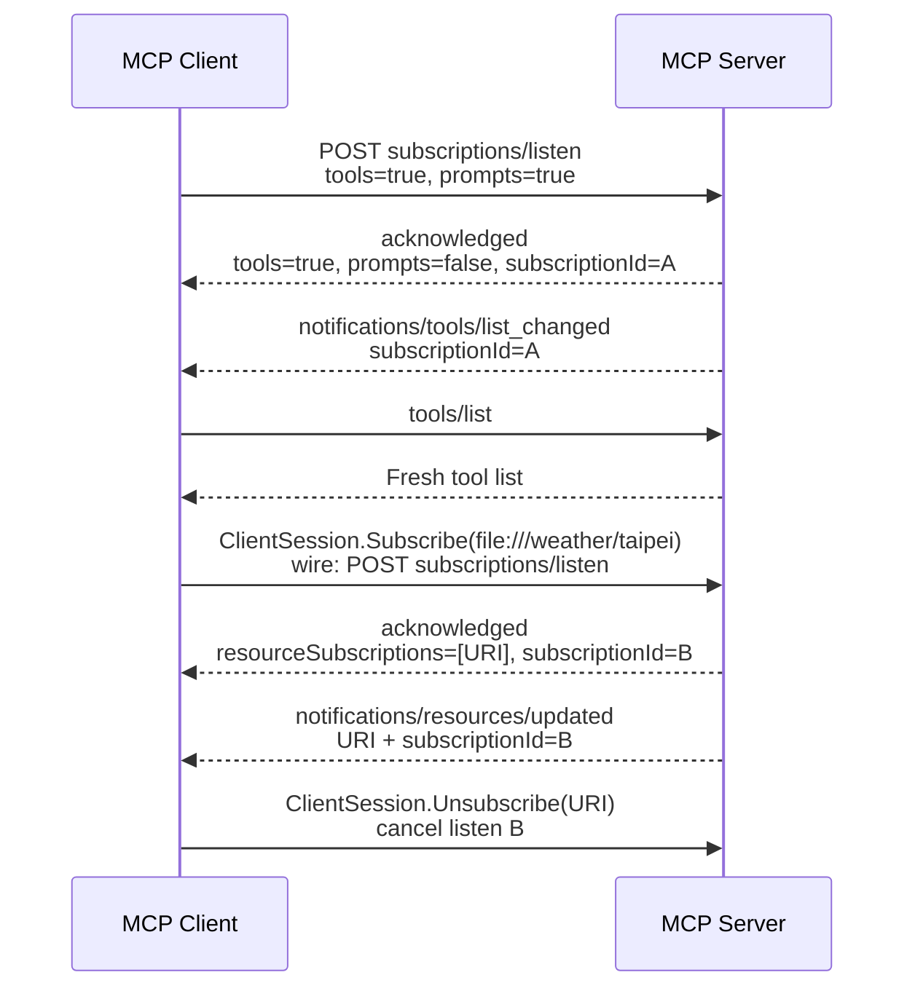

# `subscriptions/listen`：在 Stateless MCP 接收變更

本章是 [SEP-2575](https://modelcontextprotocol.io/seps/2575-stateless-mcp) 的 subscription 部分。`2026-07-28` 不再讓 server 在 session channel 隨時推送零散 change notification，也移除舊 HTTP GET stream 與 `resources/subscribe`／`resources/unsubscribe` wire RPC。client 改用長生命週期的 `subscriptions/listen` POST-response stream，明確宣告要接收的類型。

## 四種 opt-in

`SubscriptionsListenParams.notifications` 有四個彼此獨立的 opt-in：

| 欄位 | 收到的 notification |
| --- | --- |
| `toolsListChanged` | `notifications/tools/list_changed` |
| `promptsListChanged` | `notifications/prompts/list_changed` |
| `resourcesListChanged` | `notifications/resources/list_changed` |
| `resourceSubscriptions` | 指定 URI 的 `notifications/resources/updated` |

server 的第一個 stream message 必須是 `notifications/subscriptions/acknowledged`。它回覆 server 願意支援的 **subset**，並在 `_meta.io.modelcontextprotocol/subscriptionId` 放入 subscription ID。後續 notification 使用相同 ID，讓 client 對應到正確 listen stream。

## Wire flow

本章 client 同時註冊 tool 與 prompt list-change handler，但 server 只支援 tools；第一個 ack 因此證明「requested set」不一定等於「acknowledged subset」。之後公開的 `ClientSession.Subscribe` 再為單一 resource URI 開一條 listen stream。



這些 long-lived POST 是 notification 的 opt-in stream；其他 tool call 仍各自使用獨立 POST。它不會重新引入 protocol session。

## 哪些 notification 不走 listen stream

`notifications/progress` 與 `notifications/message` 是 request-scoped：它們繼續走所屬 request 的 response stream，不能被搬到 `subscriptions/listen`。原因是 progress/log message 只有在原始 request context 中才有意義；subscription stream 則處理跨 request 的 registry 或 resource change。

Tasks extension 的 `notifications/tasks` 也透過 `subscriptions/listen` opt in，但它屬於 extension 定義的 lifecycle，不是上表四個 core 欄位之一；參考 [`09-extensions-and-tasks`](../09-extensions-and-tasks/)。

## Go SDK 的自動化範圍

list-change handler 仍透過 `ClientOptions` 設定：

```go
client := mcp.NewClient(impl, &mcp.ClientOptions{
    ToolListChangedHandler: func(ctx context.Context, req *mcp.ToolListChangedRequest) {
        // go-sdk 已先 invalidate tool-list cache。
    },
})
```

modern `Client.Connect` 完成 `server/discover` 後，go-sdk 會依已設定的 tools／prompts／resources list handler 組出 `SubscriptionsListenParams`，並以背景 call 開啟 listen stream。`subscriptions/listen` 的背景呼叫在正常運作期間不會立刻取得最終 JSON-RPC result，ack 會非同步成為 stream 的第一個 notification；因此應用程式若需要確認 server 同意的 subset，必須像本章一樣觀察真實 ack，不能在 `Connect` 回傳後自行印出「acknowledged」。

目前規格與 go-sdk v1.7.0 也定義了 graceful completion：server 主動正常 teardown 時，應在關閉 stream 前送出帶相同 subscription ID 的 `SubscriptionsListenResult`（wire `resultType: "complete"`）。突然的 network／process 中斷則沒有 final result；client 仍要把它視為 subscription 已失效並重新 listen。這不把 stream 變成歷史 replay channel，final result 只區分正常結束與意外斷線。

ack 沒有獨立的 `ClientOptions` callback，但可用公開 receiving middleware 擷取：

```go
client.AddReceivingMiddleware(func(next mcp.MethodHandler) mcp.MethodHandler {
    return func(ctx context.Context, method string, req mcp.Request) (mcp.Result, error) {
        if ack, ok := req.(*mcp.ClientRequest[*mcp.SubscriptionsAcknowledgedParams]); ok {
            // 讀 ack.Params.Notifications 與 subscriptionId。
        }
        return next(ctx, method, req)
    }
})
```

resource subscription 則使用既有公開 API：

```go
err := session.Subscribe(ctx, &mcp.SubscribeParams{URI: resourceURI})
// ... receive resources/updated ...
err = session.Unsubscribe(ctx, &mcp.UnsubscribeParams{URI: resourceURI})
```

在 legacy negotiated protocol，它們送出 `resources/subscribe`／`resources/unsubscribe`；在 `2026-07-28`，go-sdk 將 `Subscribe` 轉為包含 `resourceSubscriptions` 的新 listen stream，`Unsubscribe` 則取消該 stream。應用程式可以保留同一套公開 API，但 wire behavior 不同。

server 端需提供成對的 `SubscribeHandler`／`UnsubscribeHandler`，加入 resource 讓 SDK 宣告 `ResourceCapabilities.Subscribe`，再透過 `Server.ResourceUpdated` 發 event。

## 範例在做什麼

程式先連線並取得第一個真實 ack，確認 server 接受 tools、拒絕未支援的 prompts。server 動態加入 `weather` tool 後，client handler 驗證 event ID 與 ack ID 相同，再重新呼叫 `tools/list`。

接著 client 訂閱 `file:///weather/taipei`，第二個 ack 只包含該 URI。server 呼叫 `ResourceUpdated`，client 收到相同 URI 與第二個 subscription ID，最後明確 `Unsubscribe` 並觀察 server handler 完成 teardown。

```bash
go run ./02-subscriptions-listen
```

預期輸出：

```text
connected with protocol: 2026-07-28
acknowledged subset: tools=true prompts=false resources=false resource-subscriptions=0 subscription ID present=true
received tools/list_changed; subscription ID present: true; matches acknowledgement: true
fresh tool list: weather
resource subscription acknowledged: uri=file:///weather/taipei subscription ID present=true
received resources/updated: uri=file:///weather/taipei subscription ID present=true; matches acknowledgement: true
resource unsubscribed: true
```

```bash
go test ./02-subscriptions-listen -v
```

測試分別驗證 tool list change、resource update 與 acknowledged subset。所有 channel wait 都受 context deadline 限制，且 teardown 同時檢查 `SubscribeHandler`／`UnsubscribeHandler`。

## 與 TTL cache 的關係

`subscriptions/listen` 與 SEP-2549 是互補機制：

- `ttlMs` 表示即使沒有事件，result 最久能被視為 fresh 多久。
- list-changed notification 表示 server 已知資料提前改變，client 應立即 invalidate cache。
- go-sdk v1.7.0 在呼叫使用者 handler前，就會 invalidate 對應的 tools/prompts/resources cache。

應用程式在 handler 裡通常只要觸發 UI refresh 或下一次 list operation，不要維護另一份與 SDK cache 競爭的隱藏狀態。

## 生命週期與錯誤處理

- ack 只承諾 server 同意哪些 notification，不是歷史 event replay checkpoint。
- listen stream 不論收到 graceful `SubscriptionsListenResult` 或意外中斷，若仍需要事件，client 都必須重新送 `subscriptions/listen`；`Last-Event-ID` resumability 在新 revision 已移除。
- notification 是 cache invalidation signal，不應當作 exactly-once business event log。可靠事件需使用專用 queue／durable store。
- reverse proxy buffering、idle timeout 與 connection limits 必須允許長時間 SSE response。
- client 應只訂閱需要的類型；server 必須只推送 ack subset。
- 關閉 session 會取消自動 listen；resource subscription 應優先明確 `Unsubscribe`，再 `Close`。
- handler 不可做無限期阻塞工作，否則會拖慢 notification dispatch；較重處理應交給有容量上限的 worker。

## 舊版差異

在 `2025-11-25` 等 legacy negotiated protocol 中，server 仍可能沿 shared session channel 發 list-changed notification，而 `ClientSession.Subscribe` 會真的送 `resources/subscribe`。go-sdk 依 negotiated version 選路徑；部署測試必須涵蓋實際支援的版本，不能假設兩者 wire behavior 相同。

## 延伸閱讀

- [2026-07-28 release blog](https://blog.modelcontextprotocol.io/posts/2026-07-28/)
- [2026-07-28 changelog](https://modelcontextprotocol.io/specification/2026-07-28/changelog)
- [SEP-2575：subscriptions/listen](https://modelcontextprotocol.io/seps/2575-stateless-mcp#subscriptionslisten-rpc)
- [go-sdk v1.7.0 release](https://github.com/modelcontextprotocol/go-sdk/releases/tag/v1.7.0)
