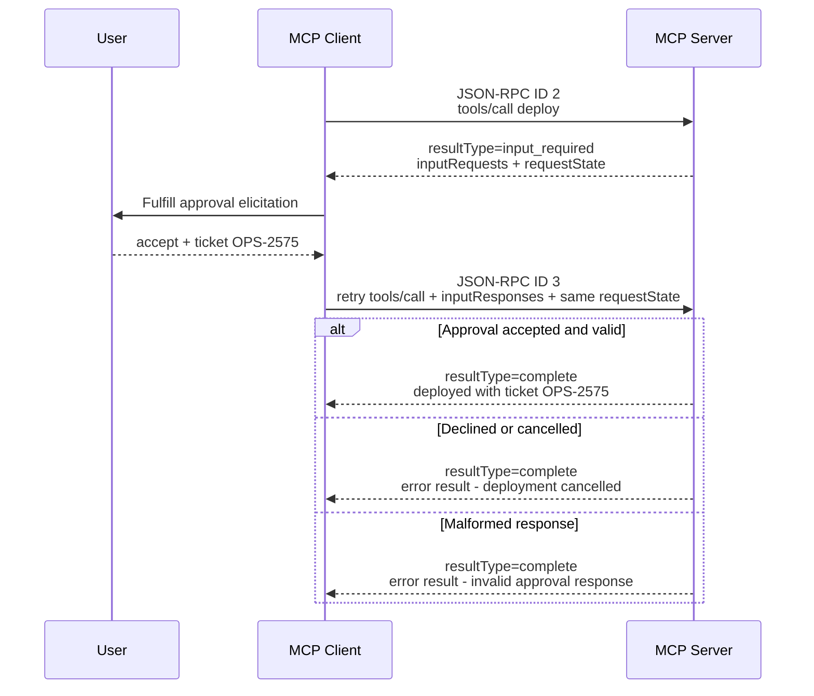

# Multi Round-Trip Requests（MRTR）

本章對應 [SEP-2322: Multi Round-Trip Requests](https://modelcontextprotocol.io/seps/2322-MRTR)。MRTR 讓 server 在處理 client-initiated request 時要求額外輸入，同時保持 stateless：server 不再發起脫離原始 context 的 JSON-RPC request，而是先回覆 `input_required`，client 完成 input requests 後，以新的 JSON-RPC request ID 重送原始 operation。

MRTR 取代過去會要求持續雙向 stream 的 `elicitation/create`、`sampling/createMessage` 與 `roots/list` server-initiated call。

## 範例流程

`deploy` tool 在真正部署前要求使用者提供核准 ticket：



tool handler 實際執行兩次；圖中的第三段是原 operation 的新 JSON-RPC request，不是沿用第一段 ID。新 ID 很重要：`2026-07-28` 已移除 stream resumability，重送是另一個 request；application 若有副作用，仍需另外設計 idempotency 或 durable workflow handle。

## `resultType` wire semantics

從 `2026-07-28` 起，所有 result 都必須帶 `resultType`：

- `"input_required"`：interim result，client 要完成 `inputRequests` 後 retry。
- `"complete"`：普通或最終 result；`IsError: true` 的 tool result 也仍是 complete。
- 舊版 server 若省略欄位，client **MUST** 將它視為 `"complete"`，避免把 legacy normal result 誤判成未完成。

第一次 response 的簡化 wire JSON：

```json
{
  "jsonrpc": "2.0",
  "id": 2,
  "result": {
    "resultType": "input_required",
    "inputRequests": {
      "approval": {
        "method": "elicitation/create",
        "params": {
          "message": "Approve production deployment?",
          "requestedSchema": {
            "type": "object",
            "properties": { "ticket": { "type": "string" } },
            "required": ["ticket"]
          }
        }
      }
    },
    "requestState": "opaque-deploy-state-v1"
  }
}
```

retry 與最終 response：

```json
{"jsonrpc":"2.0","id":3,"method":"tools/call","params":{"name":"deploy","inputResponses":{"approval":{"action":"accept","content":{"ticket":"OPS-2575"}}},"requestState":"opaque-deploy-state-v1"}}
{"jsonrpc":"2.0","id":3,"result":{"resultType":"complete","content":[{"type":"text","text":"deployed with ticket OPS-2575"}]}}
```

README 為可讀性省略每 request 的 `_meta` 與每 result 的 `serverInfo`；實際 go-sdk wire 仍包含它們。

## Server 實作重點

第一次呼叫沒有 input response 時回傳：

```go
return &mcp.CallToolResult{
    InputRequests: mcp.InputRequestMap{
        "approval": &mcp.ElicitParams{
            Message:         "Approve production deployment?",
            RequestedSchema: schema,
        },
    },
    RequestState: "opaque-deploy-state-v1",
}, nil, nil
```

go-sdk server middleware 依 `InputRequests` 自動將 wire `resultType` 設成 `input_required`；最終 result 則自動設成 `complete`。server 不需要也不能依賴未匯出的 result-type type。

第二次 handler 必須把所有 retry input 當成不受信任資料。本章的 `validateApproval` 依序檢查：

1. `requestState` 是否完整 echo。
2. `approval` key 是否存在。
3. value 是否真的是 `*mcp.ElicitResult`。
4. action 是否為 `accept`、`decline` 或 `cancel`。
5. accept 時 ticket 是否為非空字串。

因此這些寫法都被刻意避免：

```go
response := req.Params.InputResponses["approval"].(*mcp.ElicitResult)
ticket := response.Content["ticket"].(string)
```

unchecked assertion 遇到 malformed／malicious peer 會 panic。protocol schema validation 是第一層，handler 的 business validation 仍不可省略；範例的 whitespace-only ticket 可通過 JSON type 檢查，但會被 server 拒絕。

## Client 實作重點

```go
client := mcp.NewClient(impl, &mcp.ClientOptions{
    ElicitationHandler: func(ctx context.Context, req *mcp.ElicitRequest) (*mcp.ElicitResult, error) {
        return &mcp.ElicitResult{
            Action:  "accept",
            Content: map[string]any{"ticket": "OPS-2575"},
        }, nil
    },
})
```

v1.7.0 預設啟用 MRTR middleware。應用程式只呼叫一次 `ClientSession.CallTool`；middleware 會讀取 `InputRequests`、呼叫對應 client handler、填入 `InputResponses` 與 `RequestState`，再用新 JSON-RPC ID retry。server 也有 compatibility middleware，讓同一 handler 能支援 legacy client 的 server-initiated call 路徑。

本章用公開 `mcp.LoggingTransport` 擷取 wire，僅抽出兩個 `tools/call` ID 與對應 `resultType`；它沒有自行重寫或模擬 MRTR middleware。

## 哪些 result 可以要求 input

SEP-2322 限定可回傳 `InputRequiredResult` 的 client request，包括 `tools/call`、`prompts/get`、`resources/read`，以及支援 Tasks extension 時的 task-augmented request。`tools/list`、`completion/complete`、`ping` 等 request 不能任意回覆 input-required。請讓 SDK type 與 conformance test 幫忙守住範圍，不要把它當通用 continuation response。

Input request 可包含 elicitation、sampling、roots 等 protocol 定義的 request type；但 roots 與 sampling 已被 SEP-2577 deprecated，新系統應優先選擇 explicit tool arguments、client-owned model workflow 或直接 provider integration。

## URL elicitation 的變更

舊版 URL mode 曾用 `elicitationId` 與 `notifications/elicitation/complete` 通知 out-of-band interaction 完成。`2026-07-28` 已移除兩者：client 完成互動後 retry 原 request，server 從 retry 得知結果。若 server 需要跨 round correlation，應把自己的 opaque identifier 編入 `requestState`，而不是等待另一個 server-initiated completion notification。

## 執行與測試

```bash
go run ./03-multi-round-trip
```

預期輸出：

```text
round 1: server returns input_required with requestState
round 2: client handles elicitation: Approve production deployment?
round 3: retried original call with action=accept
requestState echoed unchanged: true
wire MRTR: tools/call requests=2 distinct IDs=true resultTypes=input_required,complete
final result: deployed with ticket OPS-2575 (tool handler rounds: 2)
```

```bash
go test ./03-multi-round-trip -v
```

測試涵蓋 accept、decline、cancel、malformed input、unexpected response type、requestState echo，以及 wire 上兩個不同 request ID 與 `input_required`／`complete`。錯誤 input 會得到可預期 tool error result，不會 panic。

## `requestState` 與安全性

`requestState` 對 client 是 opaque token；client retry 時只能原樣帶回，不應解析或修改。server 不可因為 state 是自己先前發出的就盲目信任：

- 明文 state 要當 untrusted input 重新驗證。
- 需要 integrity 時使用簽章；含機密資料時還要加密。
- state 必須與 authenticated user／tenant 綁定，並考慮 expiration 與 replay。
- persistent workflow 可改用 server-minted handle 指向 shared durable store。

本章的固定字串只為 deterministic teaching output，不能照搬到 production。它也不是 authorization proof。

## 常見問題

- handler 在第一 round 就產生不可重複副作用：第一次只是要求 input，應避免先部署再詢問。
- 未處理 decline／cancel：這會造成未授權操作。
- 對 `InputResponses` 或 `Content` 使用 unchecked type assertion：malformed peer 可使 server panic。
- 把 input request key 或 `requestState` 當 authorization：兩者都由不受信任 client 帶回。
- 自己再包一層 retry loop：預設 middleware 已處理，可能造成重複呼叫。
- retry 沿用舊 JSON-RPC ID：MRTR round 是新的 request。
- 認為 legacy result 沒 `resultType` 就是 invalid：相容規則要求視為 complete。

## 延伸閱讀

- [2026-07-28 release blog：MRTR](https://blog.modelcontextprotocol.io/posts/2026-07-28/#multi-round-trip-requests-mrtr)
- [2026-07-28 changelog](https://modelcontextprotocol.io/specification/2026-07-28/changelog)
- [SEP-2322 原文](https://modelcontextprotocol.io/seps/2322-MRTR)
- [SEP-2577 原文](https://modelcontextprotocol.io/seps/2577-deprecate-roots-sampling-and-logging)
- [go-sdk v1.7.0 release](https://github.com/modelcontextprotocol/go-sdk/releases/tag/v1.7.0)
