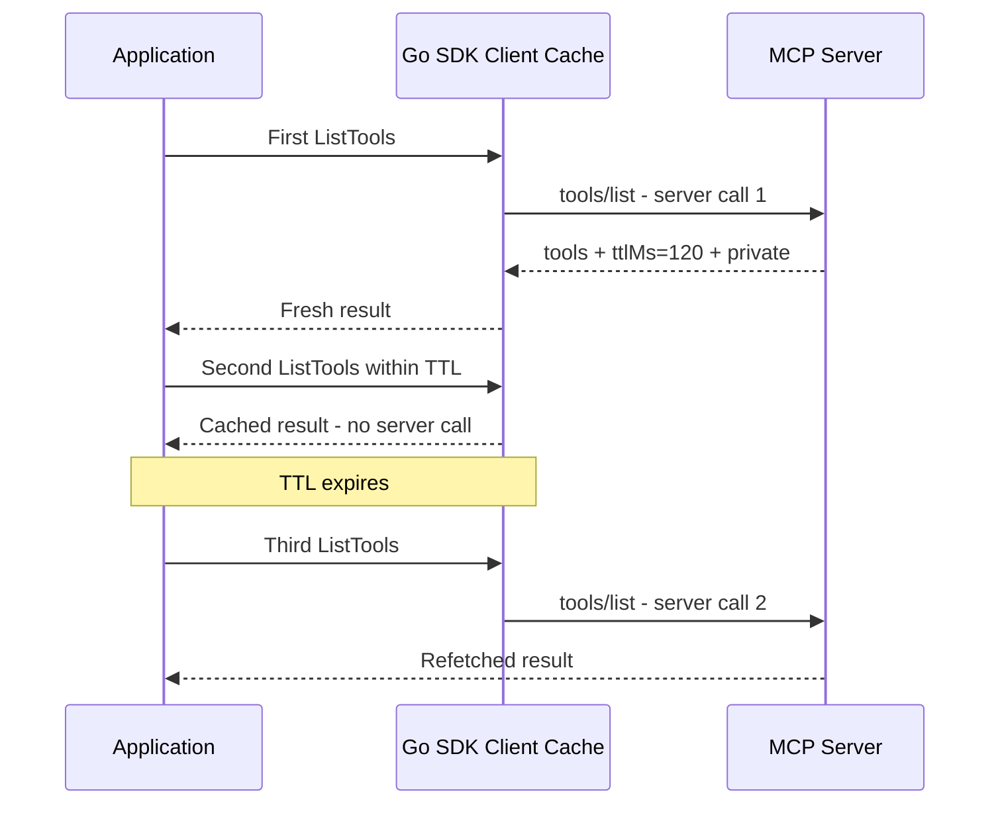

# Cacheable list results：`ttlMs` 與 `cacheScope`

本章對應 [SEP-2549: TTL for List Results](https://modelcontextprotocol.io/seps/2549-TTL-for-list-results)。Stateless／sessionless 讓不同 client 與 server replica 看見相同的 feature list，進一步允許 client 對 list result 做明確的 freshness cache，不必每次 tool call 前都重新列出所有工具。

## 新增的 result 欄位

go-sdk 用 `mcp.Cacheable` 表示兩個 wire fields：

```go
type Cacheable struct {
    TTLMs      int    `json:"ttlMs"`
    CacheScope string `json:"cacheScope"`
}
```

- `ttlMs = 0`：result 立即 stale；下一次同方法呼叫應重新請求。
- `ttlMs > 0`：從收到 response 起，在指定毫秒內可以視為 fresh。
- `cacheScope = "public"`：client 或共享 intermediary 可以 cache。
- `cacheScope = "private"`：只應由 requesting user's client cache，不得跨使用者共用。
- go-sdk 在解碼缺少 `cacheScope` 的相容輸入時會採 `public`，server-side list handler 也預設產生 `public`。但 `2026-07-28` wire result 要求 `ttlMs` 與 `cacheScope` 都存在；現代 server 不應刻意省略。若回傳使用者相關資料，必須明確設成 `private`。

語意類似 HTTP `Cache-Control: max-age` 與 public/private，但欄位位於 MCP JSON result，不等於 HTTP response cache header。

## 適用的 operation

SEP-2549 規定 `tools/list`、`prompts/list`、`resources/list`、`resources/templates/list` 與 `resources/read` result 必須帶 cache fields；go-sdk v1.7.0 也讓 `server/discover` result 實作同一個 `CacheableResult` 介面。每個 method／cursor／resource URI 有各自的 cache key；不要把某一頁 pagination result 當成完整清單。

## 範例如何設定 TTL

標準 `mcp.Server` 內建 list handler 會建立 `ListToolsResult`。本範例透過 receiving middleware 在 handler 執行後加入 cache policy：

```go
server.AddReceivingMiddleware(func(next mcp.MethodHandler) mcp.MethodHandler {
    return func(ctx context.Context, method string, req mcp.Request) (mcp.Result, error) {
        result, err := next(ctx, method, req)
        if err == nil && method == "tools/list" {
            list := result.(*mcp.ListToolsResult)
            list.TTLMs = 120
            list.CacheScope = "private"
        }
        return result, err
    }
})
```

production 可以依 feature volatility 選 TTL，或把 policy 放在共用 middleware。TTL 是 freshness hint，不是 server 對資料永遠不變的承諾；涉及 authorization 的資料仍必須在真正執行 tool／讀 resource 時重新驗權。

## Deterministic `tools/list` 順序

`2026-07-28` 另外要求 server **SHOULD** 在 underlying tool set 沒有改變時，以 deterministic order 回傳 `tools/list`。這不是 `ttlMs` 的一部分，卻直接影響 cache 的實用性：即使兩次結果包含相同工具，順序任意變動仍會改變放入 model context 的文字，降低 upstream LLM prompt-cache hit rate。

本範例故意用 `zeta-tool`、`alpha-tool`、`stable-tool` 的非排序順序註冊，且**沒有**在 middleware 手動排序。go-sdk v1.7.0 的 server feature registry 會依 feature unique ID（tool 的 ID 即名稱）排序，因此第一次抓取、cache hit 與 TTL 後 re-fetch 都得到 `alpha-tool,stable-tool,zeta-tool`。middleware 只負責加入 TTL、scope 與計數。

規格要求的是「集合不變時順序穩定」，不強制一定按名稱排序。若使用 SDK 內建 registry，這項行為已由 SDK 提供；若自行實作 list handler 或 pagination，則必須採 registration order 或另一個穩定 key，不能直接依賴 Go map iteration order。排序必須在 pagination 之前或以全域一致的方式套用，否則 page boundary 仍可能漂移。

## Client cache 是自動的

在 negotiated protocol `2026-07-28` 下，`ClientSession.ListTools` 會先查 SDK 內部 TTL cache：



應用程式不需要自己 sleep 或判斷時間；範例的 sleep 只是為了在短程式中展示到期前後差異。

```bash
go run ./04-cacheable-list-results
```

預期輸出：

```text
first list: server calls=1 ttlMs=120 scope=private order=alpha-tool,stable-tool,zeta-tool
inside TTL: server calls=1 (cache hit; order=alpha-tool,stable-tool,zeta-tool)
after TTL: server calls=2 (re-fetched; order=alpha-tool,stable-tool,zeta-tool)
```

```bash
go test ./04-cacheable-list-results -v
```

測試以 server-side atomic counter 證明第二次呼叫沒有抵達 handler，確認 TTL 後真的重新抓取，並斷言 cache hit 與 re-fetch 的 tool order 都一致。

## Notification invalidation

TTL 不必等到自然到期。如果 client 已透過 `subscriptions/listen` 訂閱 list-changed，go-sdk 收到：

- `notifications/tools/list_changed` 時 invalidates tool-list cache。
- `notifications/prompts/list_changed` 時 invalidates prompt-list cache。
- `notifications/resources/list_changed` 時 invalidates resource 與 template list cache。
- resource updated event 會 invalidates 對應 URI 的 read cache。

SDK 在呼叫使用者 notification handler 前完成 invalidation。因此下一次 `ListTools` 即使仍在原 TTL 內，也會向 server re-fetch。

## TTL 如何選擇

- 完全固定、公開的 tool catalog：可以用較長 TTL，配合 list-changed 做即時 invalidation。
- 依 authentication／tenant 變化：使用 `private` 並採較短 TTL；cache key 邊界必須包含 identity context。
- 高頻率動態資料：短 TTL 或 0，並評估它是否真的適合 list primitive。
- `server/discover`：capability deployment 變更頻率通常低，但 rolling upgrade 期間要避免 TTL 長到掩蓋版本差異。

`ttlMs` 只限制「可保持 fresh 的最長時間」。client 可以因記憶體壓力、重連或 policy 更早丟棄 cache；server 不可假設 client 一定保存到 TTL 結束。

TTL 不會啟動 background polling。client 是在下一次需要 result 時檢查 freshness；若實作另行加入 polling，應使用 jitter 與 backoff。負數 `ttlMs` 是無效輸入，client 應當作 `0`（immediately stale）處理。

## Pagination 邊界

- 每個 cursor page 是獨立 cache entry，各自從收到 response 時計算 TTL。
- 同一個 logical list request 的所有 pages 必須使用相同 `cacheScope`。
- pagination 不保證跨頁 snapshot consistency；資料在讀頁期間改變時可能看到 duplicate 或 gap。
- cursor 失效時，client 應丟棄該 list 的 cached pages，從沒有 cursor 的第一頁重新取得。
- 需要完整一致 snapshot 的 client，應從第一頁重新開始，而不是混用不同時間取得的 pages。

## 常見錯誤

- 對 user-specific result 回 `public`，造成跨使用者資料暴露。
- TTL 設很長卻未發 list-changed event，讓 client 長時間看到 stale registry。
- `tools/list` 直接由 Go map 組結果而未排序，使內容相同但 order 不穩定。
- 用 cache 取代 execution-time authorization。
- 測試只比內容相同，沒有用 counter 證明 cache hit。
- 在 legacy negotiated version 預期相同 cache 行為；SEP-2549 是新 protocol behavior。

## 延伸閱讀

- [SEP-2549 原文](https://modelcontextprotocol.io/seps/2549-TTL-for-list-results)
- [`subscriptions/listen` 範例](../02-subscriptions-listen/)
- [go-sdk v1.7.0 release](https://github.com/modelcontextprotocol/go-sdk/releases/tag/v1.7.0)
