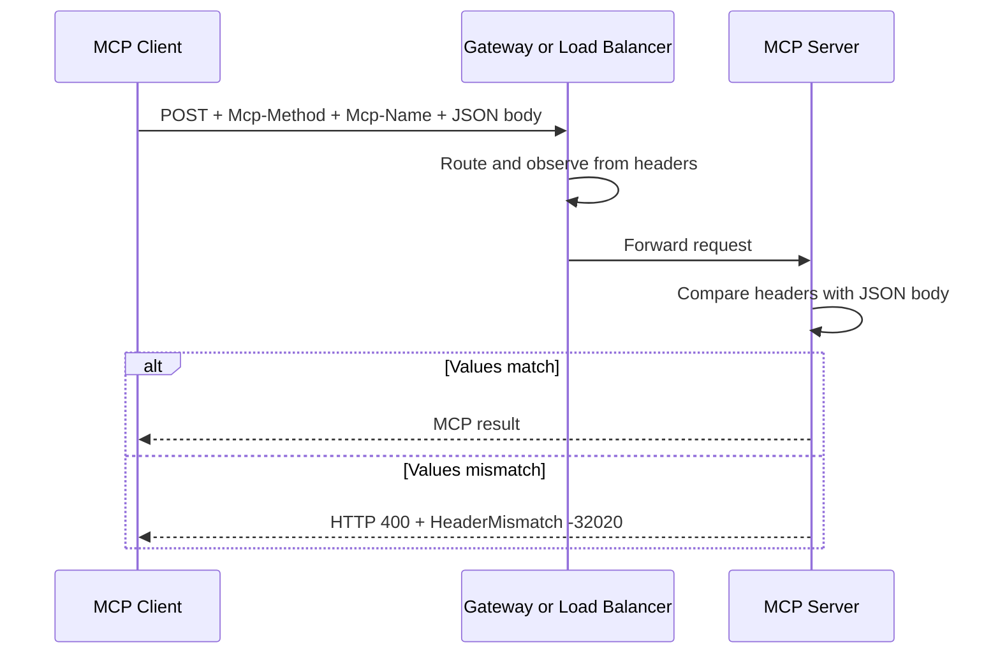

# Streamable HTTP Header Standardization

本章對應 [SEP-2243: HTTP Header Standardization for Streamable HTTP Transport](https://modelcontextprotocol.io/seps/2243-http-standardization)。新協定把 JSON-RPC body 的 routing 資訊鏡射到 HTTP headers，讓 load balancer、gateway、WAF、rate limiter 與 observability agent 不用解密後再解析完整 JSON body 才知道 operation。

## 標準 headers

在 protocol `2026-07-28` 的 Streamable HTTP POST，go-sdk 會設定：

| Header                 | 來源                               | 用途                                                    |
| ---------------------- | ---------------------------------- | ------------------------------------------------------- |
| `Mcp-Protocol-Version` | request `_meta` protocol version   | version routing／validation                             |
| `Mcp-Method`           | JSON-RPC `method`                  | 所有 request／notification 的 operation                 |
| `Mcp-Name`             | `params.name` 或 `params.uri`      | `tools/call`、`prompts/get`、`resources/read` 的 target |
| `Mcp-Param-{Name}`     | 有 `x-mcp-header` 的 tool argument | 選擇性的 region／tenant／routing hint                   |

Header name 不分大小寫，但 `Mcp-Method` 等欄位的 value 有大小寫語意。server 解析 body 後必須確認 headers 與 body 完全一致，避免 proxy 按 header 路由到低權限區，application 卻依 body 執行另一個高權限 operation。



## `x-mcp-header`

tool author 可在 input JSON Schema 的 primitive property 加 extension：

```go
InputSchema: map[string]any{
    "type": "object",
    "properties": map[string]any{
        "region": map[string]any{
            "type": "string",
            "x-mcp-header": "Region",
        },
        "query": map[string]any{"type": "string"},
    },
}
```

呼叫 `{region:"ap-east-1", query:"MCP"}` 時會產生 `Mcp-Param-Region: ap-east-1`；沒有 annotation 的 `query` 不會出現在 header。`x-mcp-header` 目前只適用 tool arguments，且 SDK 接受的 primitive 類型是 string、integer、boolean。

client 必須先看過 tool schema 才能生成 param header，因此本範例會先呼叫 `ListTools`，再呼叫 `CallTool`。**正 TTL 不是必要條件**：go-sdk v1.7.0 會保留最近看過的 tool definition，供 transport 讀取 `x-mcp-header`，即使該 `tools/list` result 的 `ttlMs` 是預設值 `0`、不再能作為 fresh list result 回傳。TTL 控制的是 `ListTools` result reuse，不是是否能為已知 tool 產生 routing header。

若 client 從未取得 schema，便不知道哪些 arguments 有 annotation；此時不應自行猜測或把所有 arguments 都複製到 headers。

## 執行

```bash
go run ./05-http-standardization
```

預期重點：

```text
tool schema discovered with ttlMs=0
Mcp-Method: tools/call
Mcp-Name: search
Mcp-Protocol-Version: 2026-07-28
Mcp-Param-Region: ap-east-1
query copied to header: false
non-ASCII region header: =?base64?5Y+w5YyX?=
mismatched header status: 400
mismatched header protocol code: -32020
missing Mcp-Method status: 400
missing Mcp-Method protocol code: -32020
rejected requests reached tool handler: false
MCP reserved errors: HeaderMismatch=-32020 MissingRequiredClientCapability=-32021 UnsupportedProtocolVersion=-32022
```

程式使用自訂 `http.RoundTripper` 記錄合法 request，接著執行三個額外案例：

1. `region="台北"` 被編碼為 `=?base64?5Y+w5YyX?=`，server decode 後仍能與 body 比對並執行 tool。
2. 將 header method 從 `tools/call` 改成 `prompts/get`，但不改 JSON body。
3. 完全移除 mandatory `Mcp-Method`。

後兩個 request 都在 dispatch tool handler **之前**回覆 HTTP 400 與 JSON-RPC `HeaderMismatch` code `-32020`。這是 protocol error，不是 `CallToolResult{IsError:true}`；範例的 counter 也證明被拒絕的 request 沒有進入 business handler。

go-sdk 在收到這類 protocol-level HTTP error 後會關閉該 client connection，因此 missing-header 案例建立新的獨立 session。不要在第一個 fatal wire error 後繼續重用舊 `ClientSession`，也不要把「connection closed」誤判成第二個 request 的 server validation 結果。

## MCP error code 配置

`2026-07-28` 正式切分 JSON-RPC server-error 範圍，避免 SDK 與日後的 MCP 標準碼碰撞：

| 範圍／常數 | 值 | 意義 |
| --- | ---: | --- |
| implementation-defined | `-32000` 到 `-32019` | SDK、transport 或 application 自訂用途；既有用法 grandfathered |
| MCP specification-reserved | `-32020` 到 `-32099` | 只由 MCP 規格配置 |
| `CodeHeaderMismatch` | `-32020` | HTTP header 與 JSON-RPC body 不一致或缺少必要 header |
| `CodeMissingRequiredClientCapabilities` | `-32021` | request 未宣告 server 所需 client capability |
| `CodeUnsupportedProtocolVersion` | `-32022` | request 要求的 protocol revision 不支援 |

範例直接輸出 go-sdk v1.7.0 的三個常數，讓升級測試同時鎖定名稱與數值。不要再沿用 draft 時期的 `-32001`、`-32003`、`-32004`。

```bash
go test ./05-http-standardization -v
```

測試斷言四個標準 header、未標註參數不外洩、non-ASCII wire encoding、missing/mismatch status 與 protocol error code，並確認兩個錯誤 request 都沒有執行 tool。

## 編碼與資料暴露

非 ASCII、control characters、前後 whitespace，或本身看似 `=?base64?...?=` sentinel 的文字不能直接安全放入 HTTP field value。SEP-2243 定義 `=?base64?<standard-base64>?=` encoding；go-sdk 負責 encode/decode。Base64 不是加密，gateway、proxy log 與 tracing backend 仍可還原內容。

不要把以下資料標註成 `x-mcp-header`：

- password、API key、access／refresh token。
- 未遮罩的個資或 health／financial data。
- 大型 prompt、SQL body、document content。
- 唯一用來授權的 tenant/user indicator。

即使 routing header 是合法且與 body 相符，server 還是要用 authenticated identity 重新驗證 region、tenant 與 resource permission。header 是可觀察的 routing hint，不是 authorization proof。

## Infrastructure 注意事項

- 確認 reverse proxy 保留 `Mcp-*` headers，且不自行覆寫。
- `2026-07-28` request 缺少 mandatory `Mcp-Method`，或 named method 缺少 `Mcp-Name`，都應在 gateway/application tests 中視為失敗，而不是由 proxy 補猜。
- rate-limit key 若使用 `Mcp-Name` 或 `Mcp-Param-*`，仍要納入 authenticated principal，避免 spoofing。
- 盤點 proxy 的單一／總 header size limits；HTTP implementation 可能回 431 或 413。
- log pipeline 只 allowlist 確定非敏感的 param headers。
- rolling upgrade 時依 negotiated protocol 決定是否要求新 headers，不能對 legacy request 無條件套用 modern validation。

## 與 SEP-2106 schema 變更的關係

同一版規格也放寬 `inputSchema`／`outputSchema`：可以使用任意 JSON Schema 2020-12 keyword；`structuredContent` 可以是任意 JSON value。SEP-2106 同時要求正確解析 `$ref`，並對 composition keyword 展開設定資源上限。這擴大了 schema 表達力，但不會擴大 `x-mcp-header` 的安全邊界：可鏡射到 header 的仍是 schema root 靜態可達的 string、integer、boolean primitive property。

production 實作應限制 `$ref` 深度、節點數與解析資源，並把無法安全靜態判定的 property 留在 JSON body；不要為了 routing 而把整份 complex value 塞進 HTTP header。

## 常見錯誤

- 呼叫 tool 前沒取得 schema：client 不知道哪些 argument 要鏡射；不要誤以為將 TTL 設長可以取代第一次 discovery/list。
- `x-mcp-header` 名稱含空白、colon、非 ASCII，或兩個 property 使用大小寫不同但實際相同的 header name；go-sdk client 會從 `tools/list` 結果排除 invalid tool 並記錄 warning。
- annotation 套在 `number`、超出 IEEE-754 safe integer 範圍的 `integer`，或不是從 schema root 靜態可達的 property。合法 primitive type 只有 string、integer、boolean。
- gateway 改 header 卻沒同步 body：server 正確回 `HeaderMismatch`。
- 把 Base64 當 confidentiality。
- 只在 proxy 驗證 header，application 不驗 body/header consistency。

## 延伸閱讀

- [SEP-2243 原文](https://modelcontextprotocol.io/seps/2243-http-standardization)
- [2026-07-28 Key Changes](https://modelcontextprotocol.io/specification/2026-07-28/changelog)
- [go-sdk v1.7.0 release](https://github.com/modelcontextprotocol/go-sdk/releases/tag/v1.7.0)
