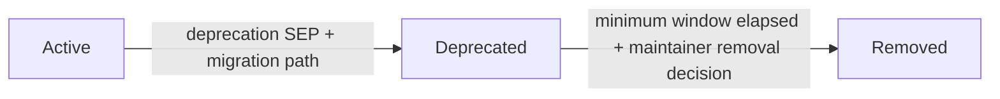
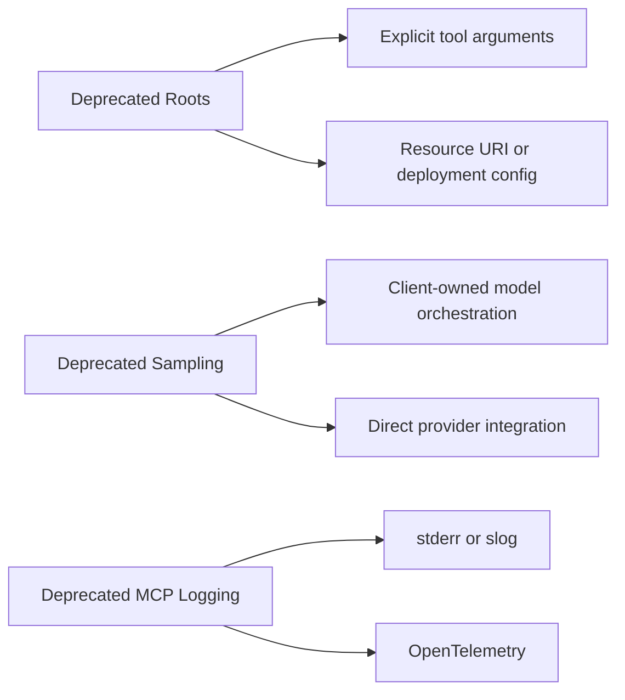

# Roots、Sampling、Logging 的 deprecation

本章對應 [SEP-2577: Deprecate Roots, Sampling, and Logging](https://modelcontextprotocol.io/seps/2577-deprecate-roots-sampling-and-logging)。從 protocol `2026-07-28` 起，三組 core feature 正式 deprecated：

- Roots：`roots/list`、`notifications/roots/list_changed`
- Sampling：`sampling/createMessage` 與相關 client capability
- Logging：`logging/setLevel`、`notifications/message`

Deprecated 不等於 go-sdk v1.7.0 已刪除所有 Go type。SDK 為仍協商舊 protocol revision 的 peer 保留相容 API，source comment 也標記 `Deprecated:`；這個 SDK API 保留期與 specification 的 deprecation clock 是不同層次。新 server 不應因為程式仍可編譯，就繼續把它們變成核心依賴。

對 negotiated protocol `2026-07-28` 還要再區分 wire form：server 不可再發出獨立的 `roots/list` 或 `sampling/createMessage` request，這類 round trip 已由 MRTR 的 `inputRequests` 取代；`logging/setLevel` 也已從此 revision 的 direct RPC 移除。舊 API「仍能工作」主要是指 SDK 與較舊 negotiated revision 的 compatibility path，不代表可以把 legacy direct RPC 發給 modern peer。

## 正式 feature lifecycle（SEP-2596）

[SEP-2596](https://modelcontextprotocol.io/seps/2596-spec-feature-lifecycle-and-deprecation) 定義三個狀態：



- **Active**：目前 revision 的正常功能，沒有排定移除。
- **Deprecated**：仍有相容窗口，但新實作 SHOULD NOT 採用，既有實作應開始遷移。
- **Removed**：目標 revision 已不再包含該功能，實作不得依賴它。

每個 deprecation SEP 必須指定至少十二個月的 minimum window，從首次帶有該 deprecation 的 Current specification release 起算。十二個月是「最早可移除時間」，不是到期自動刪除；實際 removal 仍需 maintainer decision，且可能晚得多。這項 policy 管的是 specification feature，不等於某個 Go SDK type 在同一天刪除。

官方 deprecated registry 是查詢實際日期的準則：

| Feature | Deprecated in | Earliest removal／關係 |
| --- | --- | --- |
| Roots | `2026-07-28` | 第一個在 `2027-07-28` 當日或之後發布的 revision |
| Sampling | `2026-07-28` | 第一個在 `2027-07-28` 當日或之後發布的 revision |
| Logging | `2026-07-28` | 第一個在 `2027-07-28` 當日或之後發布的 revision |
| Dynamic Client Registration | `2026-07-28` | 第一個在 `2027-07-28` 當日或之後發布的 revision；改用 CIMD，詳見第 08 章 |
| `includeContext: "thisServer"`／`"allServers"` | `2025-11-25` | 跟隨 Sampling；省略或改用 `"none"` |
| legacy HTTP+SSE transport | `2025-03-26` | SEP-2596 成為 Final 後三個月 |

`includeContext` 與 HTTP+SSE 在 lifecycle policy 建立前已被 soft-deprecated；SEP-2596 將它們正式重分類為 Deprecated。表中的 earliest removal 只代表「從此有資格移除」，不是保證當天刪除。

## 為什麼 deprecated

Roots 的語意只是 informational guidance，server 不一定遵守，而且實際 client/server adoption 低。Sampling 要正確處理 human approval、model selection、security、tool loop，複雜度高且 client 支援有限。MCP logging 則與成熟的 stderr、structured logging、OpenTelemetry 重疊，增加每個 peer 的 protocol surface。

## 替代方案

| Deprecated feature | 新設計建議                                                                                |
| ------------------ | ----------------------------------------------------------------------------------------- |
| Roots              | 明確 tool parameters、resource URI、server deployment config 或 process working directory |
| Sampling           | client/application 擁有 model orchestration；或 server 直接整合 provider API              |
| Logging            | STDIO server 寫 stderr；service 使用 `log/slog`、OpenTelemetry logs/traces/metrics        |

這些替代方案讓 data ownership、authorization 與 failure boundary 更清楚。尤其在 sessionless 架構中，不能假設某次 `roots/list` 或 logging level 會隱含地留在下一個 request。



## 可執行範例

本章的 `workflow_step` tool 同時示範三個 replacement pattern：

1. `workspaceURI` 是明確 argument，替代隱含 roots。
2. 第一次結果回傳 server-minted `job-42` handle；第二次由 client 在 `stateHandle` 明確帶回，替代 session-scoped workflow state。
3. server 用標準 `slog` 寫 application log，不經過 MCP notification。

```bash
go run ./06-deprecated-features
```

輸出包含 deterministic `slog` event 與兩次 workflow state：

```text
level=INFO msg="workflow step" handle=job-42 step=1 workspace=file:///workspace instruction="scan files"
first call: handle=job-42 step=1 workspace=file:///workspace
level=INFO msg="workflow step" handle=job-42 step=2 workspace=file:///workspace instruction="apply change"
second call: handle=job-42 step=2 workspace=file:///workspace
roots replacement: workspaceURI is an explicit tool argument
sampling replacement: the client/application owns model calls
logging replacement: use slog/stderr or OpenTelemetry outside MCP
feature lifecycle: Active -> Deprecated -> Removed (minimum 12-month deprecation window)
transport migration: legacy HTTP+SSE -> stateless Streamable HTTP
```

兩個 `level=INFO` application log 寫到 **stderr**；其餘教學輸出寫到 stdout。terminal 通常會合併顯示兩條 stream，因此實際交錯順序不應當作契約。若改用 STDIO transport，這項分流可避免 log 污染 stdout 上的 MCP JSON-RPC frames。

```bash
go test ./06-deprecated-features -v
```

測試驗證 handle 可延續至 step 2、lifecycle／transport migration guidance 都有輸出，並以不同 buffer 確認 `slog` 只進入 dedicated log writer，不會混入 stdout output。

## Sampling 的架構選擇

若一個 tool 工作流真的需要 model：

- client 已掌握模型與 user interaction 時，讓 client 先完成 model call，再把結果當 tool argument；責任與 consent 都留在 host application。
- server 是獨立 AI service 時，可直接整合 provider API，明確管理 credentials、budget、retry、streaming、model policy 與 telemetry。
- server 只是需要人類補充 structured input 時，使用 MRTR elicitation；不要為了問一個欄位而引入 sampling。

MRTR 可以承載 legacy sampling/roots input request type 以支援相容路徑，但 SEP-2322 解決的是 round-trip transport，不會取消 SEP-2577 的 deprecation decision。

## Logging migration

- STDIO transport：stdout 必須保留給 MCP wire message，application log 寫 stderr。
- HTTP service：用 `slog` 或既有 logger，再 export 到 OpenTelemetry／central log backend。
- trace correlation：把安全可公開的 request／trace ID 放入 context 與 log attributes，不要把完整 MCP arguments 無條件記錄。
- client-visible business progress 應使用正式 progress/content 機制，不要把 log notification 當 UI event。

modern request 若需要 MCP logging，應在該 request 的 `_meta.io.modelcontextprotocol/logLevel` 指定門檻，而不是先呼叫已移除的 `logging/setLevel`。server 對沒有這個欄位的 request **不得**發 `notifications/message`；log level 不再是跨 request、跨 replica 的隱含 session state。

同一版也透過 SEP-414 約定 OpenTelemetry propagation：把 W3C `traceparent`、`tracestate`、`baggage` 放在 `_meta` 對應 keys，接收端建立 child span 並沿用現有的 baggage policy。這些欄位可能跨 trust boundary；只能接受合法格式，並限制大小、allowlist baggage key，不能把未驗證 baggage 直接當 authorization input。

## Legacy HTTP+SSE transport migration

官方 `2026-07-28` blog 把舊的 **HTTP+SSE transport** 列入正式 deprecated，並以「year-long offramp」描述遷移方向；規範性 registry 則依 SEP-2596 的 transition rule，記錄其 earliest removal 為「SEP-2596 成為 Final 後三個月」。它是早期以 hanging HTTP GET 建立 session、再向另一 endpoint POST message 的 transport；新 deployment 應改用 stateless Streamable HTTP。版本規劃應以 registry 的實際列項為準。

這不表示所有 SSE framing 都被禁止。`subscriptions/listen` 在 Streamable HTTP 上仍以一個明確 opt-in 的 long-lived POST/SSE response 傳 notification；被 deprecated 的是 legacy transport/session model，而不是 `text/event-stream` 這個媒體格式本身。

## Security 與 state handle

本範例使用固定 `job-42` 只為 deterministic teaching output。production handle 必須高 entropy、不可猜測，並在 shared durable store 綁定 user/tenant、expiry 與 allowed operation。每次使用仍要 authorization；不要相信「拿得到 handle 就有權限」。

`workspaceURI` 同樣是 untrusted input。server 要 canonicalize path/URI、阻擋 directory traversal，並用 deployment policy 限制可存取範圍。明確 argument 讓 policy 好執行，不代表它自動安全。

## 延伸閱讀

- [SEP-2577 原文](https://modelcontextprotocol.io/seps/2577-deprecate-roots-sampling-and-logging)
- [SEP-2596 feature lifecycle 與 deprecation policy](https://modelcontextprotocol.io/seps/2596-spec-feature-lifecycle-and-deprecation)
- [Deprecated Features registry](https://modelcontextprotocol.io/specification/2026-07-28/deprecated)
- [2026-07-28 Key Changes（含 SEP-414 trace context）](https://modelcontextprotocol.io/specification/2026-07-28/changelog)
- [SEP-2322 MRTR](https://modelcontextprotocol.io/seps/2322-MRTR)
- [SEP-2567 Sessionless MCP](https://modelcontextprotocol.io/seps/2567-sessionless-mcp)
- [2026-07-28 specification blog](https://blog.modelcontextprotocol.io/posts/2026-07-28/)
- [go-sdk v1.7.0 release](https://github.com/modelcontextprotocol/go-sdk/releases/tag/v1.7.0)
