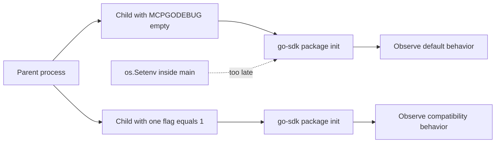

# `MCPGODEBUG`：v1.7.0 migration escape hatches

Go SDK v1.7.0 新增七個 `MCPGODEBUG` compatibility flags，讓 production 在升級後能短時間恢復修正前的 wire behavior。它們是 Go SDK 的 migration mechanism，不是 MCP protocol capability，也不會經過 `server/discover` negotiation。

SDK 在其他版本還有其他 flags；本章只涵蓋 v1.7.0 新增、並預計在 v1.9.0 移除的七個項目。新程式應採用預設行為，`=1` 只作為有 owner、期限及 migration plan 的暫時逃生門。

## 七個 v1.7.0 flags

| Flag | v1.7.0 預設行為 | 設為 `=1` 的 compatibility 行為 | 本範例如何觀察 |
| --- | --- | --- | --- |
| `customresnotfounderrcode` | resource not found 使用 `-32602` | 恢復 `-32002` | 讀取 `mcp.CodeResourceNotFound` |
| `hintomitempty` | false-valued tool hints 仍序列化 | 省略 false hints | marshal `mcp.ToolAnnotations{}` |
| `allowsessionsinstateless` | stateless server 忽略 session，DELETE 405 | 接受帶 session ID 的 DELETE | local HTTP DELETE |
| `nomethodnotfoundcodeinerror` | unknown method 回 `-32601` | wire error code 回到舊的 zero value | in-memory custom method |
| `noprotocolerrorbody` | HTTP client decode non-2xx JSON-RPC error | 只保留 HTTP status error | local failing HTTP peer |
| `nowrapinvalidparams` | params decode failure 包成 `-32602` | wire error code 回到舊的 zero value | raw invalid custom params |
| `disablecompleteparamsvalidation` | dispatch 前驗證 `ref`、`argument.name` | malformed request 仍進 handler | `completion/complete` call |

## 為什麼一定要用新 process

go-sdk 在 package initialization 時讀取 `MCPGODEBUG`。`main()` 開始執行時，flag 已固定：



因此以下寫法不可靠：

```go
import "github.com/modelcontextprotocol/go-sdk/mcp"

func main() {
    os.Setenv("MCPGODEBUG", "hintomitempty=1") // mcp package 已初始化
}
```

本章的 parent process 對七個 scenario 各啟動兩個 child process：一個清空 `MCPGODEBUG`，另一個只開對應 flag。這也避免一個測試的 process-global state 污染另一個測試。

## 執行完整比較

在 repository 根目錄執行：

```bash
go run ./07-mcpgodebug
```

輸出為 deterministic before／after matrix：

```text
Go SDK v1.7.0 MCPGODEBUG comparisons:
customresnotfounderrcode
  default: code=-32602
  =1:      code=-32002
hintomitempty
  default: json={"idempotentHint":false,"readOnlyHint":false}
  =1:      json={}
allowsessionsinstateless
  default: DELETE status=405
  =1:      DELETE status=204
nomethodnotfoundcodeinerror
  default: code=-32601
  =1:      code=0
noprotocolerrorbody
  default: surfaced code=-32022
  =1:      surfaced code=0
nowrapinvalidparams
  default: code=-32602
  =1:      code=0
disablecompleteparamsvalidation
  default: handler-called=false code=-32602
  =1:      handler-called=true code=0
```

執行 subprocess tests：

```bash
go test ./07-mcpgodebug -v
```

`TestV170CompatibilityFlags` 對每個 flag 都啟動 default／compat helper，斷言穩定的 status、error code、JSON 或 handler observation；不只檢查 flag 名稱存在。

## Scenario 實作細節

### `customresnotfounderrcode`

SEP-2164 將 resource not found 對齊 JSON-RPC `Invalid params (-32602)`。compat child 可觀察 `mcp.CodeResourceNotFound = -32002`。這個 public variable 本身已 deprecated；production code 應改用標準 error semantics，不要把舊 custom code 寫進新 API contract。

### `hintomitempty`

`ToolAnnotations.ReadOnlyHint` 與 `IdempotentHint` 是 bare `bool`。預設明確輸出 false，避免 consumer 把「false」與「欄位不存在」混為一談；compat 會回到 `{}`。

### `allowsessionsinstateless`

scenario 對 `Stateless: true` handler 送出帶 `Mcp-Session-Id` 的 DELETE。預設依 sessionless spec 回 405；compat 路徑接受並回 204。不要因為 204 就重新設計 sticky routing：flag 移除後 session header 仍會消失。

### `nomethodnotfoundcodeinerror`

client 透過 `AddSendingCustomMethod` 呼叫 server 未註冊的方法。預設 wire error 是標準 `-32601`；compat 恢復舊版無 structured code 的行為，因此觀察到 Go zero value `0`。`0` 不是新的 JSON-RPC error allocation。

### `noprotocolerrorbody`

local HTTP peer 固定回 HTTP 400，body 內放 `UnsupportedProtocolVersion (-32022)`。預設 client 能從 wrapped error 找到 `*jsonrpc.Error`；compat 只回 HTTP status，structured code 不再可見。應避免把完整 error body 無條件寫 log，但保留 structured error 對 retry policy 與診斷很重要。

### `nowrapinvalidparams`

raw request 呼叫已註冊 custom method，故意把 integer `count` 傳成 string。預設 server 回 `-32602`；compat 回到舊的 code `0`。caller 應依 standard code 處理，詳細 unmarshal message 只當 diagnostic。

### `disablecompleteparamsvalidation`

範例送出空的 `CompleteParams`。預設缺少 required `ref` 與 `argument.name`，handler 不會被呼叫並回 `-32602`；compat 會直接 dispatch。這裡以 v1.7.0 tag source 與固定版文件為準。

## Migration 建議

### Error-code flags

- `customresnotfounderrcode`：先讓 consumer 同時理解新舊 code，再關閉 flag，最後刪除對 `-32002` 的特殊分支。
- `nomethodnotfoundcodeinerror`：更新 peer 依 `-32601` 分流，不解析 human-readable message。
- `nowrapinvalidparams`：讓 caller 正確產生 params，negative tests 應涵蓋 wrong type、missing required field 與 invalid shape。
- `noprotocolerrorbody`：保留 structured code，同時限制 response body size與敏感 log。

### Wire-shape／transport flags

- `hintomitempty`：更新 snapshot 與 decoder 接受明確 false。
- `allowsessionsinstateless`：移除 `Mcp-Session-Id`、standalone GET/DELETE、sticky routing與 resumability 依賴；跨 request state 改用 explicit handle。
- `disablecompleteparamsvalidation`：先修正所有 caller 傳入合法 `ref`、`argument.name`，再移除 flag。

## Rollout checklist

1. staging 在完全沒有 v1.7.0 flags 的環境跑 integration／conformance tests。
2. production 若必須開 flag，記錄 owner、影響、metric、移除期限與 SDK v1.9.0 deadline。
3. 每次只開已確認需要的最小集合，不要複製一串全域 flags。
4. replicas 使用一致設定，避免相同 request 依 routing 得到不同 wire behavior。
5. CI 加一個 `MCPGODEBUG` 清空的 job，阻止 compatibility 變成永久 default。

## 常見錯誤

- 在 `main()` 中途 `os.Setenv`，誤以為能改 package-init state。
- 把 error code `0` 解讀為合法的 MCP code；它只是 compatibility path 的舊缺陷。
- 只確認程式能啟動，沒有比較 status／code／JSON wire shape。
- 把這些 flags 寫進 MCP capability negotiation。
- 忘記這只是 v1.7.0 新增的七個；不同 SDK 版本可能有不同 flag 與移除期限。

## 官方資料

- [go-sdk v1.7.0 release notes](https://github.com/modelcontextprotocol/go-sdk/releases/tag/v1.7.0)
- [v1.7.0 固定版 `docs/mcpgodebug.md`](https://github.com/modelcontextprotocol/go-sdk/blob/v1.7.0/docs/mcpgodebug.md)
- [SEP-2567 Sessionless MCP](https://modelcontextprotocol.io/seps/2567-sessionless-mcp)
- [SEP-2243 HTTP standardization](https://modelcontextprotocol.io/seps/2243-http-standardization)
