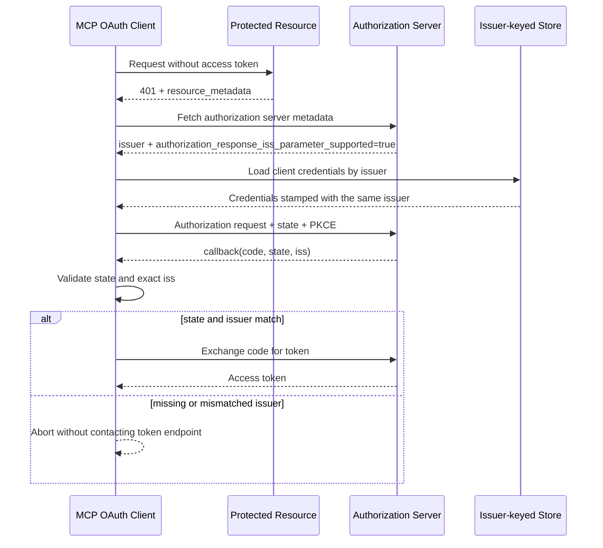
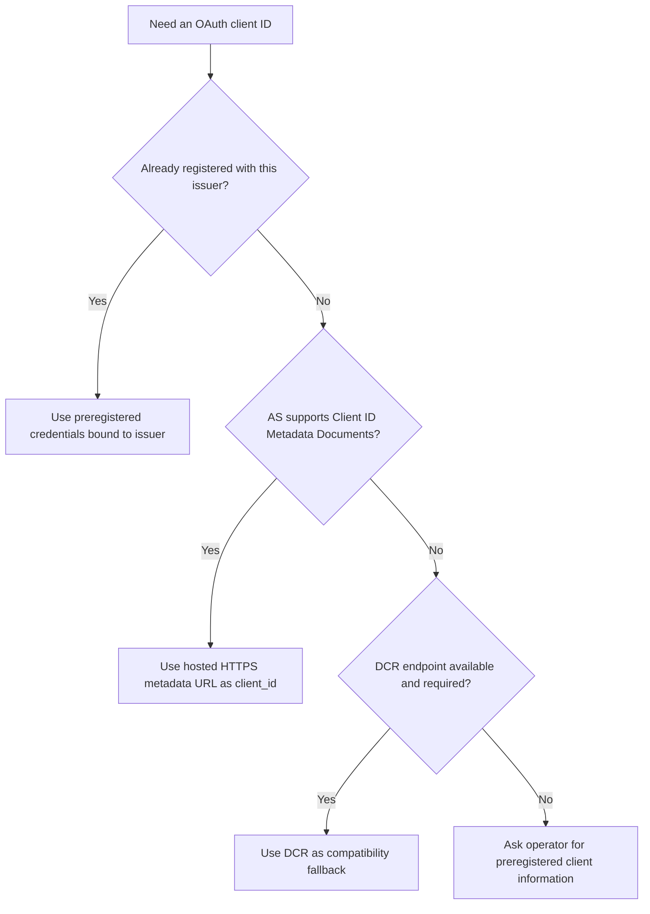

# Authorization Hardening：RFC 9207、Issuer Binding 與 Client Registration

本章補上 MCP `2026-07-28` release blog 的 authorization hardening。範例固定使用 Go SDK `v1.7.0` 的公開 `auth`／`oauthex` API，並以本機 TLS `httptest` server 完成 metadata discovery、authorization callback 與 token exchange；不需要外部 IdP、帳密或 API key。

主要變更包括：

- [SEP-2468](https://modelcontextprotocol.io/seps/2468-recommend-issuer-claim-for-auth)／[RFC 9207](https://www.rfc-editor.org/rfc/rfc9207)：authorization response 的 `iss` 必須與預期 issuer 相符。
- SEP-837：Dynamic Client Registration 必須帶正確的 OpenID Connect `application_type`。
- SEP-2352：client credentials 必須綁定並依 authorization server 的 `issuer` 分區。
- [Client ID Metadata Documents](https://modelcontextprotocol.io/specification/2026-07-28/basic/authorization/client-registration)：沒有既有合作關係時的建議註冊方式；DCR 降為 backward-compatible fallback。

## 為什麼 `iss` 驗證很重要

一個 MCP host 常同時連接多個 MCP server，而每個 resource 又可能指向不同 authorization server。若 client 只看到 callback 的 `code`，卻沒有確認是哪個 issuer 產生它，可能把 code 送到錯誤 token endpoint，形成 OAuth mix-up attack。

安全順序是先建立「預期 issuer」，完成 callback 的 `state` 與 `iss` 驗證後，才允許 code redemption：



Authorization server 宣告 `authorization_response_iss_parameter_supported: true` 時，Go SDK v1.7.0 會拒絕缺少 `iss` 的 callback；若有 `iss`，比較採 exact string match。Host 的 callback handler 必須把 redirect URI 中的 `iss` 與 `code`、`state` 一起填入 `auth.AuthorizationResult`，不能在進入 SDK 前丟掉它。

簡化後的 metadata 與 callback 如下：

```json
{
  "issuer": "https://authorization.example",
  "authorization_endpoint": "https://authorization.example/authorize",
  "token_endpoint": "https://authorization.example/token",
  "code_challenge_methods_supported": ["S256"],
  "authorization_response_iss_parameter_supported": true
}
```

```text
http://127.0.0.1/callback?code=opaque&state=expected&iss=https%3A%2F%2Fauthorization.example
```

## Go SDK v1.7.0 API 對照

| 規格責任 | 公開 API | 本章如何驗證 |
| --- | --- | --- |
| 完成 authorization code flow | `auth.NewAuthorizationCodeHandler`、`AuthorizationCodeHandler.Authorize` | local TLS fixture 走完整 discovery 與 token exchange |
| 將 callback issuer 交給 SDK | `auth.AuthorizationResult.Iss` | matching、missing、mismatched 三種 callback |
| Authorization server 宣告 RFC 9207 | `oauthex.AuthServerMeta.AuthorizationResponseIssParameterSupported` | fixture 設為 `true`，缺少 `iss` 必須失敗 |
| 預註冊 credentials 綁定 issuer | `oauthex.ClientCredentials.Issuer` | cross-issuer credentials 在 authorization 階段被拒絕 |
| DCR application type | `oauthex.ClientRegistrationMetadata.ApplicationType` | constructor 依 redirect URI 推導並驗證衝突 |
| CIMD client ID | `auth.ClientIDMetadataDocumentConfig.URL` | 驗證 HTTPS 且有 path 的 URL |

`AuthorizationCodeHandler` 會驗證已配置的 preregistered credential issuer，但 SDK 沒有提供 application credential database。範例中的 `credentialStore` 是刻意簡化的應用層模型：以 issuer 作 key，保存時同步寫入 `ClientCredentials.Issuer`，讀取另一 issuer 時一定 miss。

Production 不應直接複製這個記憶體 map。Client secret、refresh token 與其他長期 credential 應放在 OS keychain、secret manager 或加密儲存，並同時綁定 user／tenant、resource 與 issuer。

## Client registration 的選擇

`2026-07-28` 的實務選擇可整理為：



### Preregistration

適合 client 與 authorization server 已有管理關係的企業部署。務必設定 `ClientCredentials.Issuer`；resource metadata 改指向新 issuer 時，舊 client ID／secret 不能重用。

### Client ID Metadata Documents（CIMD）

適合沒有既有關係的 client。Client 將 HTTPS metadata URL 直接當 `client_id`，authorization server 在需要時取得文件。Go SDK 的 `ClientIDMetadataDocumentConfig.URL` 會拒絕 HTTP 與沒有 path 的 HTTPS URL；實務上應使用明確文件路徑，例如 `https://client.example/oauth/client-metadata.json`，不要依賴 `/` 的邊界行為。

### Dynamic Client Registration（DCR）

DCR 在本版規格中是為相容舊部署保留的 fallback，而不是新設計的預設。Go SDK v1.7.0 仍提供 `DynamicClientRegistrationConfig` 與 `oauthex.RegisterClient`，這些 Go symbols 本身沒有 `Deprecated:` annotation；「deprecated／fallback」描述的是 protocol migration 方向，不代表 API 已被移除。

OIDC server 若沒有收到 `application_type`，通常預設為 `web`，這會讓 CLI／desktop client 使用的 loopback redirect 被拒絕。v1.7.0 的推導規則是：

| Redirect URI | 推導值 |
| --- | --- |
| `http://localhost:...`、`http://127.0.0.1:...`、IPv6 loopback | `native` |
| `my-app://oauth/callback` 等 custom scheme | `native` |
| remote `https://client.example/callback` | `web` |

不要在同一份 DCR metadata 混用 native 與 remote web redirect。SDK 對無法唯一推導的集合可能留下空值；應用程式應在送出 DCR 前先拒絕這類設定。

## Registration precedence 的版本邊界

目前 authorization specification 的文字順序是 preregistration → CIMD → DCR；但 Go SDK v1.7.0 的 `AuthorizationCodeHandler` 在同時配置多種方法時，實際嘗試順序是 CIMD → preregistration → DCR。

本章不依賴這個差異：每次只傳一種 registration config。Production 若必須同時支援多種方式，應先在應用層依 resource／issuer 選定一種，再建立 handler；不要把 precedence 當成隱含且永遠不變的 SDK policy。

## 範例如何證明「失敗不兌換 code」

`newAuthorizationFixture` 使用 `httptest.NewTLSServer` 提供：

- protected resource metadata endpoint；
- authorization server metadata endpoint；
- 假的 authorization endpoint URL；
- 計數型 token endpoint。

Authorization code fetcher 不開 browser，只解析 SDK 產生的 authorization URL，echo 正確 `state`，再依測試情境提供 matching、missing 或 mismatched `iss`。測試以 token endpoint counter 作為安全 observable：只有 matching case 可以從 `0` 變成 `1`，失敗 case 必須維持 `0`。錯誤訊息可能隨 SDK 調整，因此測試不依賴整段文字。

## 執行

在 repository 根目錄執行：

```bash
go run ./08-authorization-hardening
```

預期輸出：

```text
RFC 9207 matching issuer accepted: true
token exchanges after valid response: 1
RFC 9207 mismatched issuer rejected before token exchange: true
credential lookup: same-issuer=true cross-issuer=false
DCR fallback application_type: native
CIMD non-root HTTPS configuration valid: true
```

程式刻意不輸出 authorization code、access token 或 client secret。

執行測試：

```bash
go test ./08-authorization-hardening -v
```

測試涵蓋：

- matching／missing／mismatched RFC 9207 issuer；
- matching、trailing-slash-equivalent 與 cross-issuer preregistered credentials；
- issuer-keyed application store；
- native／web DCR inference 與 explicit conflict；
- CIMD URL validation；
- main output 不洩漏 fixture code 或 token。

## 安全與 migration 注意事項

- 先驗證 callback，再兌換 code；不要把「token endpoint 拒絕」當 issuer validation。
- `iss` comparison 是 identity comparison，不要做 host-only、case-folding 或任意 path normalization。
- SDK 對 preregistered `ClientCredentials.Issuer` 容忍單一 trailing slash；範例 store 使用相同的最小 canonicalization，不做更廣泛 URL rewrite。
- `state`、PKCE 與 `iss` 各解決不同攻擊面，不能互相取代。
- Resource metadata 改變 authorization server 時，丟棄舊 issuer 的 client registration 與 token，重新選擇 registration method。
- Local TLS fixture 只用於 deterministic 教學；production 必須驗證真實 TLS、metadata URL、redirect URI 與 credential storage policy。

## 延伸閱讀

- [MCP 2026-07-28 release blog](https://blog.modelcontextprotocol.io/posts/2026-07-28/)
- [MCP authorization specification](https://modelcontextprotocol.io/specification/2026-07-28/basic/authorization)
- [Client registration approaches](https://modelcontextprotocol.io/specification/2026-07-28/basic/authorization/client-registration)
- [SEP-2468](https://modelcontextprotocol.io/seps/2468-recommend-issuer-claim-for-auth)
- [RFC 9207](https://www.rfc-editor.org/rfc/rfc9207)
- [Go SDK v1.7.0 release](https://github.com/modelcontextprotocol/go-sdk/releases/tag/v1.7.0)
