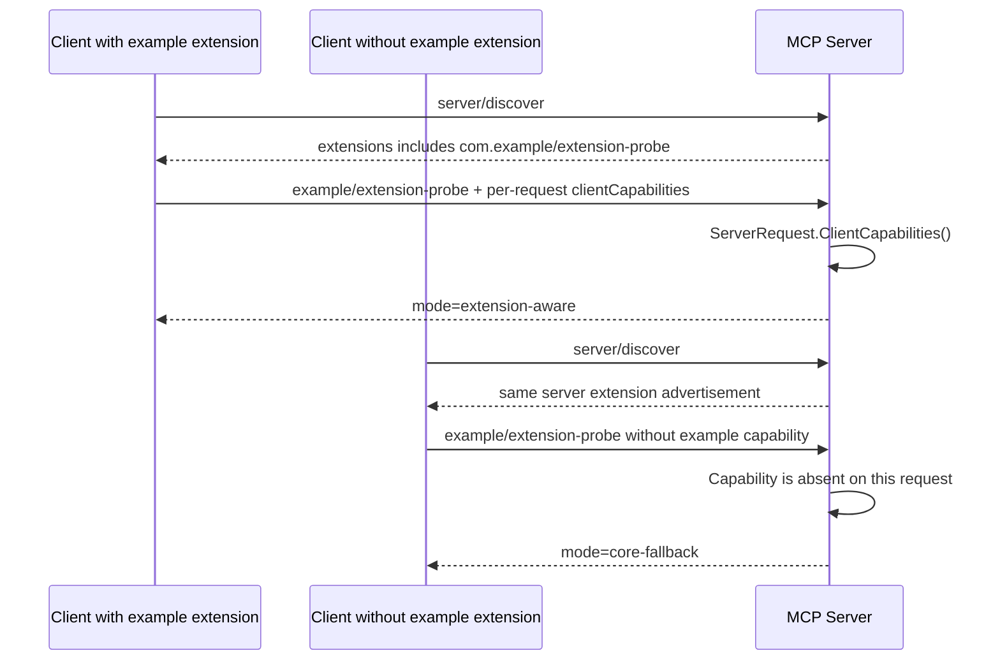
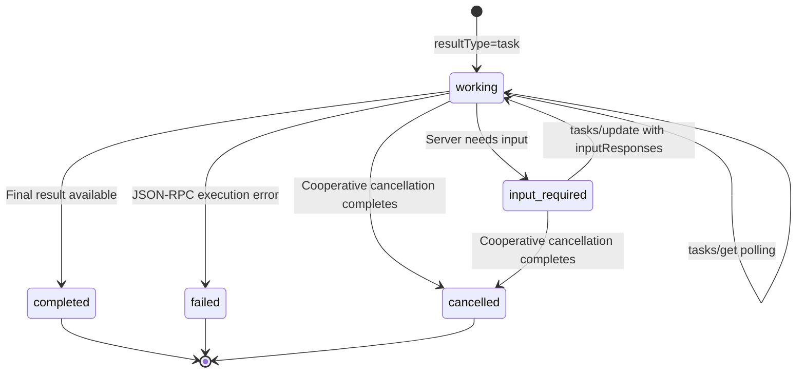

# Extensions Framework 與 Tasks Lifecycle

本章分成兩個刻意分離的層次：

1. Go 程式使用 SDK v1.7.0 的公開 API，以中性的 `com.example/extension-probe` 真實展示 extension capability advertisement、per-request opt-in 與 graceful fallback。
2. README 依 [SEP-2663: Tasks Extension](https://modelcontextprotocol.io/seps/2663-tasks-extension) 說明完整 Tasks wire lifecycle，但不虛構 Go SDK 尚未提供的 typed Tasks API。

Tasks 已從 `2025-11-25` 的 experimental core feature 移到 `2026-07-28` 的 Extensions framework。它的 identifier 是 `io.modelcontextprotocol/tasks`；它是官方 extension surface，不是 core MCP primitive，client／host 支援度仍可能不同。

可執行 server **不會**宣告 `io.modelcontextprotocol/tasks`：宣告官方 capability 就代表要履行 Tasks 的 task-augmented `tools/call`、follow-up methods 與 error semantics，不能只序列化一個 capability name。因為 v1.7.0 尚無完整 typed surface，本章用自有 identifier 驗證通用 framework，Tasks 則以官方 wire spec 獨立教學。

## Extensions 解決什麼問題

Core specification 若為每個新能力立即增加 method 與 type，所有 SDK、client 和 server 都必須同時更新。Extensions framework 讓能力先以明確 identifier 獨立演進：

- 預設關閉，client 與 server 都必須 opt in。
- Client capability 隨每個 request 傳送，符合 stateless protocol。
- Server capability 由 `server/discover` 回覆。
- 單邊支援不能視為完成 negotiation；application 必須採 core fallback 或回覆明確 error。
- Extension settings 必須是 JSON object；目前 Tasks 沒有額外 settings，所以使用 `{}`。

Identifier 使用 reverse-domain vendor prefix，例如 `com.example/search-v2`。`io.modelcontextprotocol/*` namespace 由 MCP project 保留，應用程式不能自行在該 namespace 發明 extension。

## 本章可執行的 negotiation flow



Server 宣告支援 example extension，不代表可以對所有 client 回傳 extension-only payload。第二個 client 看得到 server capability，但它自己沒有 opt in，因此 custom method 提供可 decode 的 core fallback。每個真正 extension 都要自行規定可否 fallback；若能力是必要條件，也可以回明確 missing-capability error。

### Wire 上的位置

Client 在每個 request 的 `_meta` 宣告：

```json
{
  "jsonrpc": "2.0",
  "id": 1,
  "method": "example/extension-probe",
  "params": {
    "_meta": {
      "io.modelcontextprotocol/protocolVersion": "2026-07-28",
      "io.modelcontextprotocol/clientCapabilities": {
        "extensions": {
          "com.example/extension-probe": {}
        }
      }
    }
  }
}
```

Server 在 discovery result 宣告：

```json
{
  "result": {
    "resultType": "complete",
    "supportedVersions": ["2026-07-28"],
    "capabilities": {
      "extensions": {
        "com.example/extension-probe": {}
      }
    },
    "ttlMs": 0,
    "cacheScope": "public",
    "_meta": {
      "io.modelcontextprotocol/serverInfo": {
        "name": "extension-server",
        "version": "1.0.0"
      }
    }
  }
}
```

## Go SDK v1.7.0 API 對照

| 目的 | 公開 API |
| --- | --- |
| 宣告 client extension | `ClientCapabilities.AddExtension`、`ClientOptions.Capabilities` |
| 宣告 server extension | `ServerCapabilities.AddExtension`、`ServerOptions.Capabilities` |
| Client 讀取 server advertisement | `ClientSession.InitializeResult().Capabilities.Extensions` |
| Server 讀取當次 request capability | `ServerRequest.ClientCapabilities()` |
| 註冊非標準 client→server request | `mcp.AddSendingCustomMethod`、`mcp.AddReceivingCustomMethod` |
| 呼叫 custom request | `mcp.CallCustomMethod` |

`AddExtension(identifier, nil)` 會把 `nil` 正規化為空 object，而不是 JSON `null`。SDK 只傳遞 capability map，不會自動計算「已 negotiated extensions」、驗證 identifier 是否在 registry，或自動替 handler 做 feature gating；這些判斷仍是 extension implementation 的責任。

範例使用自有 identifier `com.example/extension-probe` 與中性的 method `example/extension-probe`，只證明 generic framework 能運作。Server receiving middleware 將 generic `mcp.Request` type-assert 成 probe 的 `mcp.ServerRequest`，再呼叫 `ClientCapabilities()`；這很重要，因為它讀到的是該次 request `_meta`，不是沿用某個舊 session 的 capability。

## Tasks extension 的完整 lifecycle

Tasks 適合需要跨 timeout、斷線或 process restart 的長時間工作。Server 決定某次受支援的 request 是否建立 task；client 只宣告「能處理 task」，不在每次 tool call 要求一定建立 task。



狀態語意：

| Status | 意義 |
| --- | --- |
| `working` | 工作進行中；client 依 `pollIntervalMs` 節流 polling |
| `input_required` | `tasks/get` 帶回 `inputRequests`，client 以 `tasks/update` 回應 |
| `completed` | `result` 是原始 request 最終會回傳的 result；tool-level `isError: true` 仍屬 completed |
| `failed` | 執行遇到 JSON-RPC error，細節放在 `error` |
| `cancelled` | 工作已進入取消終態；cancel request 本身只代表 cooperative intent |

`completed`、`failed`、`cancelled` 是 terminal states，不應再轉換。Task 必須在 create response 送出前 durable：client 一拿到 `taskId`，下一次 `tasks/get` 就必須能解析該 ID。

### 1. Server-directed task creation

在目前 SEP-2663 revision 中，唯一可被 task-augment 的標準 method 是 `tools/call`；規格保留未來擴充其他 request type 的空間，但現在不能讓 `prompts/get`、`resources/read` 或任意 custom method 回 `CreateTaskResult`。Client 宣告 extension 後，`tools/call` 仍可能取得同步 `CallToolResult`，也可能取得：

```json
{
  "jsonrpc": "2.0",
  "id": 10,
  "result": {
    "resultType": "task",
    "taskId": "opaque-high-entropy-id",
    "status": "working",
    "createdAt": "2026-08-03T01:00:00Z",
    "lastUpdatedAt": "2026-08-03T01:00:00Z",
    "ttlMs": 3600000,
    "pollIntervalMs": 2000
  }
}
```

Server 絕不能對未在當次 request 宣告 Tasks capability 的 client 回傳 `resultType: "task"`。如果 operation 無法提供同步 fallback，應回 missing-required-capability error，而不是讓舊 client 收到無法 decode 的 shape。

### 2. `tasks/get` polling

Client 以 `taskId` 查詢完整狀態，並尊重 server 可動態調整的 `pollIntervalMs`。`ttlMs` 從建立時間計算；過期後 server 可以丟棄 task，因此 client 若要跨 restart 繼續追蹤，必須持久保存 task ID 與必要的 resource／issuer context。

### 3. `tasks/update` mid-flight input

當狀態為 `input_required`，response 會包含 keyed `inputRequests`。Client 顯示 elicitation 或完成其他 input request，再以相同 key 放入 `inputResponses`。這和 SEP-2322 MRTR 不同：

- 建立 task 前需要 input：原始 request 使用 MRTR retry。
- task 執行中需要 input：以 `tasks/get` 取得，再用 `tasks/update` 回覆；不重送原始 tool call。

### 4. `tasks/cancel`

Cancellation 是 cooperative。成功 ack 表示 server 已接受取消意圖，不保證 worker 已立即停止，也不保證最後一定成為 `cancelled`；工作可能已先完成。client 若仍需要最終狀態，**MAY** 繼續用 `tasks/get` 觀察，但規格不要求一定再 poll，也允許 client 在送出 cancel 後丟棄本地追蹤狀態。未知或未授權的 task ID 應直接回 error。

### 5. `notifications/tasks`

Polling 是基本路徑。若雙方支援 notification，client 透過 `subscriptions/listen` opt in 特定 task IDs；server 的 acknowledged notification 回覆實際接受的 IDs。每個 `notifications/tasks` event 帶完整 task state，client 不必為取得同一版本狀態再呼叫一次 `tasks/get`。

Task stream 不是 progress／logging stream；`notifications/progress` 與 `notifications/message` 不應混進 Tasks subscription。Listen stream 意外中斷時需要重新訂閱，不能把 delivery 當 exactly-once business event log。

### Streamable HTTP routing

SEP-2663 明確擴充 SEP-2243 的 routing 規則：`tasks/get`、`tasks/update`、`tasks/cancel` 走 Streamable HTTP 時，client **MUST** 將 JSON-RPC method 放進 `Mcp-Method`，並將 `params.taskId` 放進 `Mcp-Name`。這讓 gateway 能讓同一 task 的 follow-up 落到持有該 task state 的 instance。

`taskId` 仍不是 authorization proof；server 每次都要驗證 bearer token、tenant、task ownership 與 scope。若採真正的 stateless multi-replica task store，任何 replica 應能依 task ID 從 shared durable store 載入狀態；routing affinity 只能是最佳化，不能取代 durable state 與授權。

## 從舊 experimental Tasks migration

`2025-11-25` experimental core Tasks 與 SEP-2663 extension 不具 wire compatibility：

- 舊 `tasks/result` 被移除，改由 `tasks/get` 取得狀態與 final result。
- 舊 `tasks/list` 被移除；避免列出不屬於目前 caller 的 task IDs。
- Tool call 上的舊 `task` opt-in parameter 被移除；新流程只看當次 request capabilities，由 server 決定是否建立 task。
- 舊 `tasks.requests.*` capability 改為單一 `io.modelcontextprotocol/tasks` extension identifier。

Gateway 若需同時服務舊 client，必須依 protocol version 與 capability 明確分流，不能把兩套 shape 混在同一 request path。

## Go SDK v1.7.0 的明確邊界

> **本章沒有實作 Tasks protocol。** v1.7.0 有 generic extension maps 與 typed custom request helpers，但沒有 first-class Tasks types 或完整 lifecycle hooks。

此版本缺少：

- typed `Task`／`CreateTaskResult`／status union；
- `tools/call` 的同步 result 與 `resultType: "task"` polymorphic decode surface；
- 標準 `tasks/get`、`tasks/update`、`tasks/cancel` client/server methods；
- 可註冊的 `notifications/tasks` typed notification handler。

其中最關鍵的限制是 standard `CallToolResult` 的 `resultType` 在 SDK 內部不可由應用程式設成 `task`，client 也沒有取得 `taskId` 的欄位。就算用 local custom structs 拼出三個 polling methods，仍無法正確完成「標準 tool call 建立 task」與 notification lifecycle，反而會誤導讀者以為 SDK 已支援。

因此 Go 程式只宣告 `com.example/extension-probe` 並註冊 `example/extension-probe`，完全不宣告 Tasks capability，也不註冊任何保留的 Tasks method。測試透過 registered-method inventory 持續守住這個界線。未來升級到提供正式 Tasks package 的 SDK 時，應直接採用該版本的 typed API 與 conformance tests，再宣告 `io.modelcontextprotocol/tasks`。

## 執行

在 repository 根目錄執行：

```bash
go run ./09-extensions-and-tasks
```

預期輸出：

```text
server discover advertises com.example/extension-probe: true
supported client per-request extension: true
supported client path: extension-aware
unsupported client per-request extension: false
unsupported client path: core-fallback
```

執行測試：

```bash
go test ./09-extensions-and-tasks -v
```

測試會確認：

- Server extension 確實經由 discovery 抵達 client。
- Client extension 確實存在於每次 request metadata。
- 未支援的 client 取得同步 core fallback。
- `nil` settings 在 JSON 中是 `{}` 而非 `null`。
- 範例只宣告／註冊 neutral extension probe，沒有冒充官方 Tasks capability 或 methods。
- boundary test 實際呼叫 `tasks/get`、`tasks/update`、`tasks/cancel`，三者都得到 `MethodNotFound (-32601)`，證明這是未宣告 Tasks 的 generic server；不是把未知 task 錯回成未註冊 method 的「半套 Tasks server」。

## Extension implementation checklist

- 在 client 與 server 各自宣告同一 identifier，並計算實際交集。
- 每次 request 都重新檢查 client capability；不要從舊 session 推論。
- 未 negotiated 時提供可 decode 的 fallback 或明確 protocol error。
- Settings schema 要版本化，unknown fields 應採 forward-compatible policy。
- Extension method、notification、error 與 reserved namespace 必須跟官方 spec 一致。
- Task ID 使用足夠 entropy，且每次 follow-up 都做 authentication／authorization。
- 對 polling 做 rate limit，對 TTL、cancellation 與 terminal state 定義清楚。

## 同一 framework 的其他 extensions

- [MCP Apps](https://modelcontextprotocol.io/extensions/apps/overview)：server-rendered interactive UI。
- [Authorization Extensions](https://modelcontextprotocol.io/extensions/auth/overview)：OAuth Client Credentials 與 Enterprise-Managed Authorization。
- [Extension support matrix](https://modelcontextprotocol.io/extensions/client-matrix)：確認特定 host／SDK 的實際支援度。

這些 extensions 各自有 capability、security model 與 SDK support boundary；看到同一 `extensions` map 不代表能共用 method 或 trust assumptions。

## 延伸閱讀

- [MCP 2026-07-28 release blog](https://blog.modelcontextprotocol.io/posts/2026-07-28/)
- [Extensions overview](https://modelcontextprotocol.io/extensions/overview)
- [SEP-2133: Extensions](https://modelcontextprotocol.io/seps/2133-extensions)
- [Tasks overview](https://modelcontextprotocol.io/extensions/tasks/overview)
- [SEP-2663: Tasks Extension](https://modelcontextprotocol.io/seps/2663-tasks-extension)
- [Go SDK v1.7.0 release](https://github.com/modelcontextprotocol/go-sdk/releases/tag/v1.7.0)
