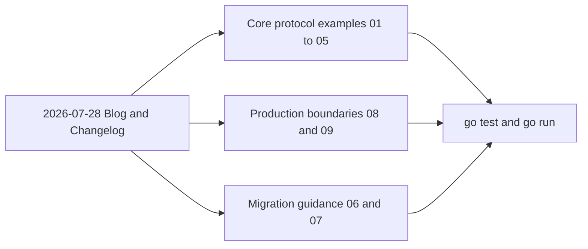

# MCP Go SDK v1.7.0：2026-07-28 協定範例

這個專案用可執行的 Go 程式說明 `github.com/modelcontextprotocol/go-sdk v1.7.0` 對 MCP protocol `2026-07-28` 的重要支援。重點不是只展示 SDK 函式，而是讓你實際看到 session header 消失、長連線 subscription、MRTR 重送、TTL cache、HTTP routing headers、authorization hardening、extension negotiation、deprecated feature 的替代方案，以及 `MCPGODEBUG` 的新舊行為。

內容以官方 release blog 與 full changelog 為學習地圖，涵蓋其中最重要、能由 Go SDK v1.7.0 公開 API 清楚示範的主題；它不是整份 MCP specification 的本地複本，也不宣稱每一個 extension 都已有 Go typed API。

## 快速開始

```bash
git clone https://github.com/go-training/mcp-2026-07-28.git
cd mcp-2026-07-28
go mod download
go test ./...
```

所有範例都會自行啟動 in-memory transport 或 loopback HTTP server，不需要另外部署 MCP server。

## 環境需求

- Go 1.25 或更新版本。go-sdk v1.7.0 的 `go.mod` 要求 Go 1.25。
- 範例執行期間不需要外部 MCP server、API key、資料庫或網路服務；HTTP 範例只使用 `httptest` 的 loopback server。首次執行 `go mod download` 仍需要網路下載 Go modules。
- 所有範例固定使用 `github.com/modelcontextprotocol/go-sdk v1.7.0`，不依賴 `main` branch 或 pre-release。

確認版本：

```bash
go version
go list -m github.com/modelcontextprotocol/go-sdk
```

## 範例索引

| 目錄                                                        | 規格                        | 可以觀察到什麼                                                                |
| ----------------------------------------------------------- | --------------------------- | ----------------------------------------------------------------------------- |
| [`01-stateless-sessionless`](./01-stateless-sessionless/)   | SEP-2575、SEP-2567          | `server/discover`、空 session ID、沒有 `Mcp-Session-Id`、GET/DELETE 405       |
| [`02-subscriptions-listen`](./02-subscriptions-listen/)     | SEP-2575                    | 自動開啟 `subscriptions/listen`、ack、帶 subscription ID 的 list-change event |
| [`03-multi-round-trip`](./03-multi-round-trip/)             | SEP-2322                    | `input_required` → client elicitation → 自動重送原始 tool call                |
| [`04-cacheable-list-results`](./04-cacheable-list-results/) | SEP-2549                    | `ttlMs`、`cacheScope`、TTL 內 cache hit 與到期後 re-fetch                     |
| [`05-http-standardization`](./05-http-standardization/)     | SEP-2243                    | `Mcp-Method`、`Mcp-Name`、`Mcp-Param-*` 與 `-32020 HeaderMismatch`            |
| [`06-deprecated-features`](./06-deprecated-features/)       | SEP-2577                    | roots、sampling、logging 的狀態與 explicit replacement patterns               |
| [`07-mcpgodebug`](./07-mcpgodebug/)                         | go-sdk v1.7.0 compatibility | 七個 escape hatch，以及必須用新 process 比較的 init-time 行為                 |
| [`08-authorization-hardening`](./08-authorization-hardening/) | SEP-2468、SEP-837、SEP-2352 | RFC 9207 `iss`、DCR `application_type`、issuer-bound credentials 與 CIMD      |
| [`09-extensions-and-tasks`](./09-extensions-and-tasks/)     | SEP-2133、SEP-2663          | extension capability negotiation、graceful fallback 與 Tasks lifecycle 邊界  |

建議先讀 01、02 建立 stateless transport 心智模型，再讀 03～05 的互動、cache 與 routing。08、09 說明 production auth 與 optional extension 邊界；06、07 則適合在 migration／rollout 階段查閱。

## Blog 主題 coverage

| 官方 release 主題                         | 主要章節 | 補充位置 | 本專案的可執行邊界 |
| ----------------------------------------- | -------- | -------- | ------------------ |
| No handshake or sessions                 | 01       | 02、06   | per-request metadata、discover、explicit state handle |
| Multi Round-Trip Requests                 | 03       | 06       | elicitation、`requestState`、retry；不重新發 server-initiated RPC |
| Header-based routing                      | 05       | 01       | standard headers、`x-mcp-header`、mismatch／missing errors |
| Cacheable and deterministic list results  | 04       | 02、05   | TTL cache、scope、stable tool ordering |
| Authorization hardening                   | 08       | 06       | local OAuth fixture；無外部 IdP 或真實 credentials |
| Formal extensions framework and Tasks     | 09       | 02       | generic negotiation 可執行；Tasks 用官方 wire lifecycle 解說 |
| Deprecations and compatibility            | 06       | 07       | lifecycle、replacement patterns、Go SDK migration flags |



## 快速驗證

```bash
go fmt ./...
go vet ./...
go test ./...
go test -race ./...
```

逐一執行：

```bash
go run ./01-stateless-sessionless
go run ./02-subscriptions-listen
go run ./03-multi-round-trip
go run ./04-cacheable-list-results
go run ./05-http-standardization
go run ./06-deprecated-features
go run ./07-mcpgodebug
go run ./08-authorization-hardening
go run ./09-extensions-and-tasks
```

每個程式會自行啟動 in-memory 或 loopback server，完成一次完整 client/server 互動後退出，不需要先開第二個 terminal。

## 版本相容性的核心規則

`2026-07-28` 與先前版本的生命週期不同。HTTP server 只有在 `StreamableHTTPOptions.Stateless = true` 時才接受新版本；若 server 保持 stateful，go-sdk client 會協商到 `2025-11-25`。因此不要只看 Go API 是否存在，要同時檢查實際 negotiated protocol。

go-sdk 保留舊版 peer 的相容路徑。這代表 deprecated type 還能編譯，並不代表它適合新設計；同樣地，`MCPGODEBUG` 只為短期 migration 預留，v1.7.0 release 明確說明本版新增的七個 flag 將於 v1.9.0 移除。

Tasks 已是官方 `io.modelcontextprotocol/tasks` extension，不是 experimental core；但 go-sdk v1.7.0 尚未提供 `Task`、`CreateTaskResult`、`TasksGet` 或 task notification 等 first-class typed API。因此第 09 章的可執行程式只宣告中性的 `com.example/extension-probe`，使用 SDK 真正提供的 extension capability 與 custom-method API 示範 negotiation；它不會宣告官方 Tasks capability，也不用本地型別假裝完成 Tasks implementation。Tasks lifecycle 則依官方 wire specification 在該章 README 中獨立解說。

## 其他 changelog 變更

以下變更很重要，但不值得各自建立一個容易誤解為完整 feature implementation 的目錄：

- SEP-414 的 OpenTelemetry `traceparent`、`tracestate`、`baggage` `_meta` convention，放在第 06 章 observability migration。
- SEP-2106 的完整 JSON Schema 2020-12、`$ref` resource bounds 與任意 JSON `structuredContent`，在第 05 章作 related schema note。
- schema generator 將 minimum／maximum／default 正確表示為 number，是 schema 修正而非 runtime workflow。
- SEP-1850 規範 SEP 的 PR／governance 流程，不是 MCP client/server wire feature。

## 官方資料

- [go-sdk v1.7.0 release notes](https://github.com/modelcontextprotocol/go-sdk/releases/tag/v1.7.0)
- [2026-07-28 specification release blog](https://blog.modelcontextprotocol.io/posts/2026-07-28/)
- [2026-07-28 full changelog](https://modelcontextprotocol.io/specification/2026-07-28/changelog)
- [go-sdk repository](https://github.com/modelcontextprotocol/go-sdk)
- [MCP specification](https://modelcontextprotocol.io/specification/2026-07-28)
- [MCP extensions overview](https://modelcontextprotocol.io/extensions/overview)
- [MCP Tasks overview](https://modelcontextprotocol.io/extensions/tasks/overview)
- [Deprecated features registry](https://modelcontextprotocol.io/specification/2026-07-28/deprecated)
- [SEP index](https://modelcontextprotocol.io/seps)

README 中的 JSON 與 wire flow 是為了教學而簡化；實際 schema 與 error handling 以固定版本的 SDK、正式 specification 與各 SEP 原文為準。
