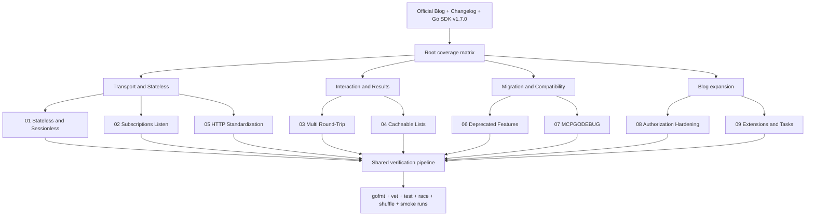
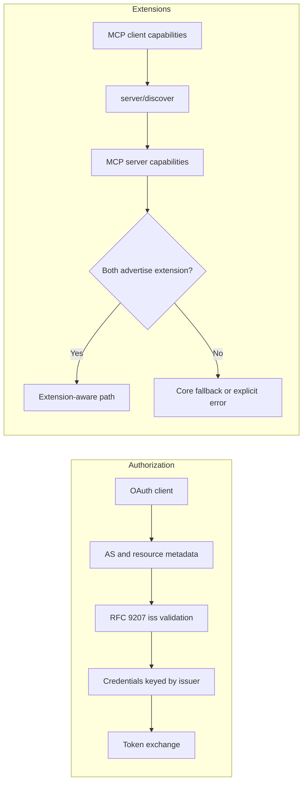
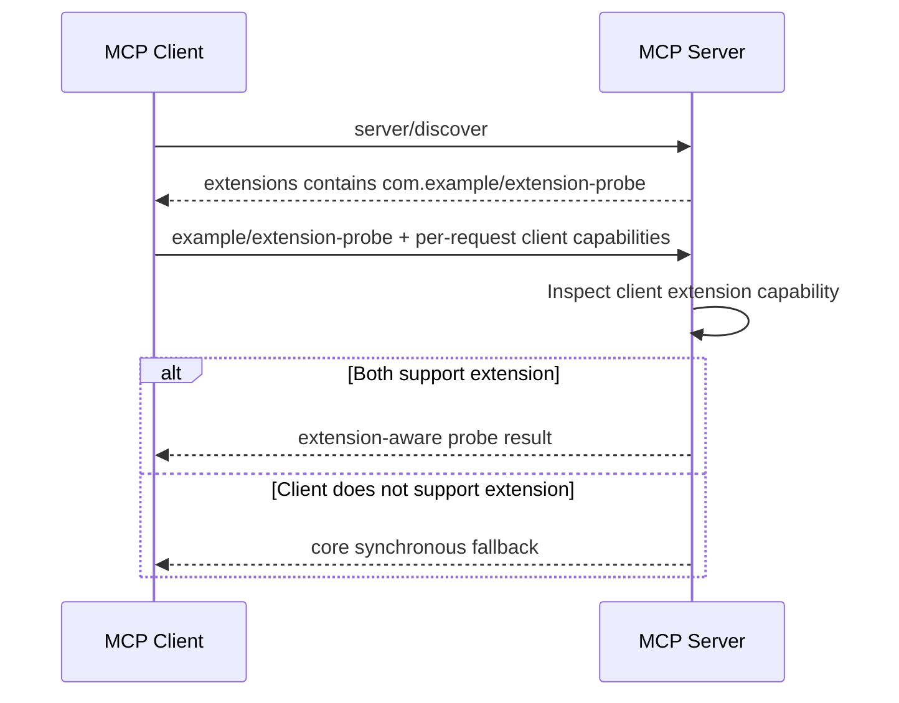
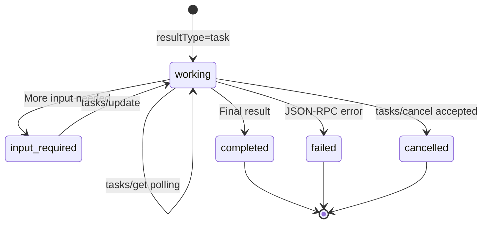

# Plan: 補齊 MCP 2026-07-28 Blog 與 Go SDK v1.7.0 教學

> 狀態：使用者已核准；實作與完整驗證已於 2026-08-03 完成。
>
> Baseline：`01`～`07` 原已存在；本次補強 `01`～`07` 並新增 `08`、`09`。最終 `gofmt`、`go vet`、test、race、shuffle、repeat、module verify 與九個 smoke run 均通過。

## 目標

在維持 `github.com/modelcontextprotocol/go-sdk v1.7.0` 的前提下，把目前依 release notes 建立的七章教學補強成能對照 MCP 官方 2026-07-28 release blog 與完整 changelog 的繁體中文範例專案。既有 `01`～`07` 應補上遺漏的 wire semantics、錯誤與 migration 邊界；另新增 Authorization hardening 與 Extensions／Tasks 兩章。每章維持詳細 README、Mermaid、可執行 Go 範例與自動測試，且不得宣稱 Go SDK v1.7.0 具有實際不存在的 Tasks typed API。

## 依據與版本邊界

- [2026-07-28 specification release blog](https://blog.modelcontextprotocol.io/posts/2026-07-28/)
- [2026-07-28 specification changelog](https://modelcontextprotocol.io/specification/2026-07-28/changelog)
- [Go SDK v1.7.0 release notes](https://github.com/modelcontextprotocol/go-sdk/releases/tag/v1.7.0)
- [Extensions overview](https://modelcontextprotocol.io/extensions/overview)
- [Tasks overview](https://modelcontextprotocol.io/extensions/tasks/overview)
- [Deprecated features registry](https://modelcontextprotocol.io/specification/2026-07-28/deprecated)

實作只使用 v1.7.0 tag 中的公開 API。官方 specification 描述 protocol 能力；Go SDK release 與 tag source 決定本專案能實際編譯、執行及測試的能力。兩者有落差時，README 必須明確標示，不以本地替代型別假裝 SDK 已完整支援。

## 現況盤點

| 位置 | 現有內容 | 本次主要補強 |
| --- | --- | --- |
| Root | 七章索引、版本與驗證命令 | Blog／changelog coverage、08/09、支援邊界 |
| `01-stateless-sessionless` | sessionless HTTP、discover、GET/DELETE 405 | per-request metadata、serverInfo、version error、重送規則 |
| `02-subscriptions-listen` | tools list-changed stream | 真實 ack、resource subscriptions、request-scoped stream 邊界 |
| `03-multi-round-trip` | elicitation accept/decline retry | `resultType`、`requestState`、安全解碼、URL elicitation 變更 |
| `04-cacheable-list-results` | TTL hit／expiry | deterministic ordering、required cache fields、pagination 邊界 |
| `05-http-standardization` | routing headers、mismatch | missing header、Base64 sentinel、error allocation、修正 TTL 說明 |
| `06-deprecated-features` | roots/sampling/logging 替代方向 | lifecycle registry、HTTP+SSE、`includeContext`、stderr 修正 |
| `07-mcpgodebug` | 七個 flag 表格、三個可執行比較 | 七個 flag 都有 subprocess behavior assertion |
| `08-authorization-hardening` | 尚不存在 | RFC 9207、issuer binding、DCR application type、CIMD migration |
| `09-extensions-and-tasks` | 尚不存在 | extension negotiation、fallback、Tasks wire lifecycle 與 SDK 邊界 |

## 高階架構



新章的 runtime 關係：



## Scope

### May modify

- `README.md`
- `plan.md`
- `01-stateless-sessionless/README.md`
- `01-stateless-sessionless/main.go`
- `01-stateless-sessionless/main_test.go`
- `02-subscriptions-listen/README.md`
- `02-subscriptions-listen/main.go`
- `02-subscriptions-listen/main_test.go`
- `03-multi-round-trip/README.md`
- `03-multi-round-trip/main.go`
- `03-multi-round-trip/main_test.go`
- `04-cacheable-list-results/README.md`
- `04-cacheable-list-results/main.go`
- `04-cacheable-list-results/main_test.go`
- `05-http-standardization/README.md`
- `05-http-standardization/main.go`
- `05-http-standardization/main_test.go`
- `06-deprecated-features/README.md`
- `06-deprecated-features/main.go`
- `06-deprecated-features/main_test.go`
- `07-mcpgodebug/README.md`
- `07-mcpgodebug/main.go`
- `07-mcpgodebug/main_test.go`
- 新增 `08-authorization-hardening/{README.md,main.go,main_test.go}`
- 新增 `09-extensions-and-tasks/{README.md,main.go,main_test.go}`
- `go.mod`、`go.sum` 僅在 Go tooling 確實需要時調整；預期不新增 dependency，且 go-sdk 必須維持 `v1.7.0`。

### Must not modify

- 工作目錄以外的檔案。
- go-sdk module cache 或任何上游 source。
- Go 版本與 `github.com/modelcontextprotocol/go-sdk v1.7.0` pin。
- 使用外部 OAuth server、MCP server、API key、真實 client secret 或資料庫。
- 建立本地 `mcp.Task`、`mcp.CreateTaskResult` 等看似 SDK 官方 API 的替代型別。
- 宣稱 `tasks/get`、`tasks/update`、`tasks/cancel` 或 `notifications/tasks` 已獲 Go SDK v1.7.0 first-class 支援。
- 為 SEP governance、schema generator 修正等非 runtime 主題建立誤導性的 executable feature 目錄。
- 在本計畫取得明確核准前修改 README 或 Go implementation。

## 共通教學格式

每個 README 最少包含：

1. 問題與規格動機。
2. 對應 SEP／spec／release 連結。
3. 至少一張 Mermaid sequence 或 flow diagram。
4. 2026-07-28 wire behavior。
5. Go SDK v1.7.0 公開 API 對照。
6. `go run` 與 `go test` 命令。
7. 預期輸出及可觀察的成功條件。
8. 錯誤、安全、相容性與 migration 注意事項。
9. 「規格有定義但此 SDK 版本未提供 typed API」的明確標記（若適用）。

所有程式延續現有模式：

- 以 `run(ctx, printf)` 或相同可測試結構隔離 I/O。
- 高階 MCP interaction 使用 in-memory transport。
- HTTP／wire 行為使用 `httptest`、recording `RoundTripper` 或 raw request fixture。
- 所有 wait 使用 context deadline 或 bounded channel timeout。
- 輸出固定且可由測試斷言，不比對不穩定的完整 error message 或完整 JSON snapshot。

## 實作計畫

### Phase 1：Root coverage 與閱讀路徑

#### `README.md`

- 將索引擴充為 `01`～`09`，新增：
  - `08-authorization-hardening`
  - `09-extensions-and-tasks`
- 新增「官方 Blog 主題 → 教學章節」coverage table。
- 加入 Blog、full changelog、extensions、Tasks、deprecated registry 連結。
- 更新建議閱讀順序：
  1. 01/02 建立 stateless transport 心智模型。
  2. 03/04/05 學習 MRTR、cache 與 routing。
  3. 08/09 學習 auth 與 extension boundary。
  4. 06/07 完成 migration 與 compatibility。
- 一鍵執行命令擴充到九章。
- 新增 coverage boundary：
  - SEP-414 trace context 放在 root/06 observability note，不建獨立目錄。
  - SEP-2106 JSON Schema 2020-12／`structuredContent` 放在 root/05 related changes。
  - schema number generator fix 僅列 changelog note。
  - SEP-1850 為治理流程，只提供官方連結。
- 在全部完成前不使用「完整涵蓋全部 specification」；完成後仍表述為「涵蓋 Blog 主題及選定 changelog changes」。

驗收：root table 的每個 Blog 主題都有唯一主要章節，所有相對路徑可開啟，所有 `go run` 命令存在。

### Phase 2：補強現有 `01`～`07`

#### `01-stateless-sessionless`

README：

- 明確區分 server MUST implement `server/discover` 與 client MAY call；說明 go-sdk `Client.Connect` 會自動先嘗試 discover。
- 列出每次 request 的 `_meta`：protocol version、client capabilities、clientInfo，以及每個 result 的 serverInfo。
- 補充 `UnsupportedProtocolVersion = -32022` 與 supported versions data。
- 說明 response stream 中斷後不得用 `Last-Event-ID` resume；client 必須以新 JSON-RPC request ID 重送。
- 補充新協定移除 `ping`、standalone GET、session DELETE 與 resumability 的邊界。
- explicit state handle 章節交叉連到 06 的 executable replacement example。

程式：

- 在 tool handler 使用 `CallToolRequest.ProtocolVersion()`、`ClientInfo()`、`ClientCapabilities()` 觀察 per-request metadata。
- 從 client 收到的 result `_meta` 驗證 `mcp.MetaKeyServerInfo`。
- 保留 session ID 空值與 GET/DELETE 405 的既有示範。
- 加入 raw modern request helper，送出不支援的 protocol version，記錄 `-32022` 與 supported versions。

測試：

- 擴充 `TestRunShowsSessionlessHTTP`，斷言 metadata triple 與 serverInfo。
- 新增 `TestUnsupportedProtocolVersionReturnsStructuredError`。
- raw fixture 只比對 status、JSON-RPC code 與 supported version array，不 snapshot 整個 response。

驗收輸出至少包含：`protocol=2026-07-28`、client identity/capabilities present、serverInfo present、session header false、GET/DELETE 405、unsupported code `-32022`。

#### `02-subscriptions-listen`

README：

- 完整列出 `toolsListChanged`、`promptsListChanged`、`resourcesListChanged`、`resourceSubscriptions` 四種 opt-in。
- 說明 modern `ClientSession.Subscribe` 公開 API 會轉成 `subscriptions/listen`，wire 上不再傳 legacy `resources/subscribe`。
- 區分 subscription stream 與 request-scoped `notifications/progress`／`notifications/message` response stream。
- 說明 listen 斷線需要重新 listen，notification 不是 exactly-once business log。
- 連到 09 的 `notifications/tasks` lifecycle 說明。

程式：

- 保留 tools list-changed path。
- server 新增 subscribable resource 與 `SubscribeHandler`／`UnsubscribeHandler`。
- client 增加 `ResourceUpdatedHandler`，呼叫 `ClientSession.Subscribe` 訂閱明確 URI，再由 `Server.ResourceUpdated` 發 event。
- client receiving middleware 實際攔截 `notifications/subscriptions/acknowledged`，記錄 server 同意的 subset；移除目前僅在 Connect 後自行印出的假 ack。
- 對 tool event 與 resource event 都驗證 subscription ID。
- 結束前 `Unsubscribe`／`Close`，避免 goroutine 殘留。

測試：

- 擴充 tools list-changed test。
- 新增 `TestRunReceivesResourceUpdateOnListenStream`。
- 新增 `TestAcknowledgementContainsOnlySupportedSubscriptions`。
- 所有 channel wait 都設 timeout；重複測試用於偵測競態與 flaky teardown。

驗收輸出至少包含真實 acknowledged subset、`weather` tool refresh、指定 URI 的 resource update、兩種 event 都有 subscription ID。

#### `03-multi-round-trip`

README：

- 加入 `resultType: "input_required"` 與 `resultType: "complete"` wire JSON。
- 說明 legacy result 缺 `resultType` 時 client 必須視為 `complete`。
- 說明 URL elicitation 已移除 `elicitationId` 與 `notifications/elicitation/complete`；跨 retry correlation 使用 `requestState`。
- 補充 MRTR retry 應是新的 JSON-RPC request ID，不能重用原 request。

程式：

- 第一次 input-required result 加入 deterministic opaque `RequestState`。
- 第二次 handler 驗證 client 原樣 echo `requestState`。
- 移除 `InputResponses["approval"].(*mcp.ElicitResult)` 的 unchecked assertion；安全檢查 key、type、action、ticket type/value。
- 保留 accept 與 decline，加入 cancel／malformed response 的 error result，不 panic。
- 加 recording fixture 只擷取 MRTR wire 的 request IDs 與 `resultType`，不自行重寫 MRTR middleware。

測試：

- 保留 accept／decline。
- 新增 `TestExecuteEchoesRequestState`。
- 新增 `TestExecuteRejectsMalformedInputWithoutPanic`。
- 新增 `TestMRTRWireUsesResultTypesAndNewRequestID`。

驗收：tool handler 仍執行兩次；state 原樣 round-trip；interim/final resultType 正確；retry ID 不同；錯誤 input 產生可預期 error result 而非 panic。

#### `04-cacheable-list-results`

README：

- 加入 `tools/list` deterministic order 的 SHOULD 與 LLM prompt cache 理由。
- 修正 modern results 的規範語意：`ttlMs`、`cacheScope` 是新 protocol 的 required fields；不要把省略 scope 當成 server 建議做法。
- 區分 specification 列出的 cacheable results 與 Go SDK 對 `server/discover` 的額外支援。
- 補充 pagination：每頁 cache key、各頁 scope consistency、invalid cursor、沒有跨頁 snapshot 保證。
- 說明 negative TTL 視同立即 stale；TTL 不等於 background polling。

程式：

- 以反向註冊順序加入 `zeta-tool`、`alpha-tool`，展示 SDK 依 tool name deterministic 輸出。
- 每次 list 印出 ordered names、TTL、scope 與 server call counter。
- 保留 TTL 內 hit 與 expiry 後 re-fetch。

測試：

- 擴充 `TestRunCachesUntilTTLExpires`，同時斷言 `alpha-tool,zeta-tool`。
- 新增 `TestToolOrderRemainsDeterministicAcrossFetches`，涵蓋 cache hit 與 expiry 後重新抓取。

驗收：反向註冊不影響 ascending deterministic result；TTL 內 counter 不增加，過期後只增加一次。

#### `05-http-standardization`

README：

- 修正「正 TTL 是產生 `Mcp-Param-*` 的必要條件」：真正必要的是 client 先取得 tool schema；正 TTL 只避免立即 re-fetch。
- 加入 MCP error allocation：implementation-defined `-32000..-32019`、spec-reserved `-32020..-32099`，並列出 `-32020`、`-32021`、`-32022`。
- 補 missing mandatory header 與 mismatch 都回 `HeaderMismatch -32020`。
- 完整列出 `x-mcp-header` primitive／nested／name 約束；`number` 不允許，integer 必須在 IEEE-754 safe range。
- 說明 invalid annotation 在 registration 與 client filtering 的實際邊界，不籠統宣稱所有情況都在同一階段拒絕。
- 加入 `=?base64?...?=` sentinel，強調 encoding 不等於 encryption。

程式：

- 將 recording transport 的單一 boolean corruption 改成明確 mode：valid、mismatched method、missing name。
- 增加一次 non-ASCII annotated param 呼叫，記錄 Base64 sentinel header。
- 印出三個 MCP reserved error constants。
- 保留未標註 `query` 不會外洩到 header 的斷言。

測試：

- 擴充既有 header test。
- 新增 `TestMissingMandatoryHeaderReturnsHeaderMismatch`。
- 新增 `TestNonASCIIParamUsesBase64Sentinel`。
- 新增 `TestMCPErrorCodeAllocation`。

驗收：合法 headers、缺失與 mismatch、Base64 value、非 header argument 隱私及三個 error codes 全部可觀察。

#### `06-deprecated-features`

README：

- 加入 SEP-2596 lifecycle：Active → Deprecated → Removed，並說明 earliest removal 不等於一定移除日期。
- 連結正式 deprecated registry，列出：
  - Roots／Sampling／Logging／DCR：最早為 2027-07-28 當日或之後發布的首個 revision。
  - `includeContext: thisServer/allServers`：跟隨 Sampling。
  - HTTP+SSE：依 SEP-2596 transition window。
- 明確區分：deprecated Go type／legacy protocol 相容，與 `2026-07-28` 已移除 direct RPC 並不相同。
- 補 `logging/setLevel` 移除及 `io.modelcontextprotocol/logLevel` per-request replacement。
- 補 SEP-414 `traceparent`、`tracestate`、`baggage` observability note。
- 強化範例中的 in-memory map 只供教學；多 replica production 必須 shared durable store。

程式：

- 將 `main()` 傳給 `run` 的 log writer 從 `os.Stdout` 修正為 `os.Stderr`，與 README 的 STDIO 指引一致。
- 保留 explicit workspace URI、state handle 與 client-owned orchestration guidance；不增加外部 model provider dependency。
- 輸出中明示 application log channel 與 MCP result channel 的責任分界。

測試：

- 保留 replacement pattern test。
- 新增 writer separation test：`slog` 只進指定 log writer，教學輸出只進 `printf` collector。

驗收：程式不再示範把 application log 寫到 STDIO protocol stdout；README lifecycle 與 registry dates 一致。

#### `07-mcpgodebug`

README：

- 將標題與文案限定為「v1.7.0 新增的七個 flags」，不暗示 SDK 只存在七個 compatibility flags。
- 說明 `MCPGODEBUG` 是 Go SDK migration mechanism，不是 MCP protocol capability 或 negotiation。
- 官方連結改為 v1.7.0 tag 固定的 `docs/mcpgodebug.md`，避免鼓勵 import internal package。
- 每個 flag 都列 default、compat、migration owner、預計移除版本與對應測試 fixture。

程式與 subprocess fixtures：

- 保留：
  - `customresnotfounderrcode`
  - `hintomitempty`
  - `disablecompleteparamsvalidation`
- 新增：
  - `allowsessionsinstateless`：比較 stateless server 的 session header／DELETE 行為。
  - `nomethodnotfoundcodeinerror`：以獨立 process 的 STDIO/raw peer 比較 `-32601`。
  - `noprotocolerrorbody`：local HTTP peer 回 non-2xx JSON-RPC body，比較 client 是否 surface protocol error。
  - `nowrapinvalidparams`：raw invalid params request 比較標準 `-32602` 與舊 raw behavior。
- 每個 behavior 都由新 process 啟動，確保 flag 在 package init 前生效。

測試：

- 將 `runHelper` 擴充為可指定 scenario 與 debug flags。
- 建立 table-driven `TestV170CompatibilityFlags`，七個 flags 各有 default／compat assertion。
- 不比對整段 human-readable message，只比對穩定的 status、code、JSON key 或 boolean observation。

驗收：七個 v1.7.0 flags 均有至少一個自動化 before/after behavior assertion；不存在只列名稱而未驗證的 flag。

### Phase 3：新增 `08-authorization-hardening`

#### Runtime flow

```mermaid
sequenceDiagram
    participant C as MCP OAuth Client
    participant R as Protected Resource
    participant AS as Authorization Server
    participant Store as Issuer-keyed Credential Store

    C->>R: Request without token
    R-->>C: 401 + protected resource metadata
    C->>AS: Discover authorization metadata
    AS-->>C: issuer + RFC 9207 support
    C->>AS: Authorization request
    AS-->>C: code + state + iss
    C->>C: Validate state and iss before token exchange
    alt issuer matches
        C->>Store: Load credentials by issuer
        C->>AS: Redeem authorization code
        AS-->>C: Access token
    else missing or mismatched issuer
        C-->>C: Reject; do not redeem code
    end
```

#### `README.md`

- SEP-2468／RFC 9207：authorization response 帶 `iss` 時的 validation，及 AS 宣告支援時缺少 `iss` 的拒絕行為。
- SEP-837：loopback/custom-scheme client 使用 `application_type=native`，remote HTTPS 使用 `web`。
- SEP-2352：credentials 必須以 issuer 分區，issuer 改變時不得 reuse，必須重新註冊或選擇對應 preregistration。
- DCR 已 deprecated，CIMD 是無既有關係 client 的主要方案；preregistration 適用已有關係的部署。
- 清楚標示 SDK API 與應用責任：
  - SDK 有 `AuthorizationCodeHandler`、issuer validation 與 `ClientCredentials.Issuer`。
  - SDK 沒有 application credential persistence store；範例的 issuer-keyed map 只是教學模型。
- 說明 v1.7.0 同時提供多個 registration config 時的選擇順序與現行 spec wording 可能不同；範例每次只配置一種，避免隱含 precedence。
- 所有 server 都是 `httptest` local fixture，不可把範例 secret-storage pattern 直接用於 production。

#### `main.go`

- 定義 local TLS fake protected resource／authorization server，提供 deterministic metadata、authorization 與 token endpoints。
- 使用公開 API：
  - `auth.NewAuthorizationCodeHandler`
  - `auth.AuthorizationResult{Iss: ...}`
  - `oauthex.ClientCredentials{Issuer: ...}`
  - `oauthex.ClientRegistrationMetadata{ApplicationType: ...}`
- Happy path 實際走到 token exchange，並證明合法 `iss` 被接受。
- application-level `credentialStore` 以 canonical issuer key 儲存／查找；另一 issuer 查不到第一個 issuer 的 credentials。
- 展示 loopback redirect 自動推導 `native`，以及 CIMD HTTPS non-root URL configuration。
- main output 不印 token、code、secret；只印 validation outcome。

#### `main_test.go`

- `TestAuthorizeValidatesRFC9207Issuer`
  - matching `iss` 成功且 token endpoint 只被呼叫一次。
  - missing／mismatched `iss` 失敗且 token endpoint 呼叫次數為零。
- `TestPreregisteredCredentialsAreBoundToIssuer`
  - matching issuer 可用。
  - different issuer 被拒絕；單一 trailing slash 依 SDK 規則視為等價。
- `TestCredentialStoreKeysByIssuer`
  - issuer A credentials 不會由 issuer B 取得。
- `TestDCRApplicationTypeInference`
  - loopback/custom scheme → native；remote HTTPS → web；conflicting explicit value → error。
- `TestCIMDRequiresNonRootHTTPSURL`
  - 合法 non-root HTTPS 通過 config validation；HTTP/root URL 被拒絕。

驗收：valid issuer path 能完成；三種 issuer failure 均在 token exchange 前停止；DCR 只以 backward-compatible fallback 呈現；沒有真實 credential 或外部網路依賴。

### Phase 4：新增 `09-extensions-and-tasks`

#### Runtime flow



README 另提供 Tasks specification lifecycle；它不是本章 Go 程式宣稱完成的 API：



#### `README.md`

- 說明 official extension identifier、reverse-domain vendor prefix、settings object 與 explicit opt-in。
- 說明 client capabilities 位於每個 request `_meta`，server capabilities 位於 `server/discover`。
- Extension disabled by default；單邊支援時必須 graceful fallback 或明確 error。
- Tasks 是 `io.modelcontextprotocol/tasks` 官方 extension，不是 experimental core。
- 完整說明：
  - unsolicited `resultType: "task"` task handle。
  - `tasks/get` polling。
  - `tasks/update` 回覆 mid-flight input。
  - `tasks/cancel` cooperative cancellation。
  - terminal states：completed／failed／cancelled。
  - `notifications/tasks` 透過 `subscriptions/listen` opt-in。
  - 舊 `tasks/result`／`tasks/list` 已移除。
- SDK boundary callout：v1.7.0 有 generic extension capabilities 與 typed custom-method API，但沒有 Tasks result types、standard tool polymorphic task result、Tasks methods 或 custom task notification handler。
- 解釋為何不以 custom local types拼出「半套 Tasks」：最關鍵的 standard request `resultType: task` 與 notification lifecycle無法由公開 API 正確表示。
- MCP Apps、OAuth Client Credentials、EMA 僅作同一 framework 的 ecosystem 導覽。

#### `main.go`

- 使用：
  - `ClientCapabilities.AddExtension`
  - `ServerCapabilities.AddExtension`
  - `ClientSession.InitializeResult().Capabilities.Extensions`
  - `mcp.AddSendingCustomMethod`
  - `mcp.CallCustomMethod`
  - `mcp.AddReceivingCustomMethod`
- executable extension identifier 使用 `com.example/extension-probe`；`nil` settings 經 SDK 正規化為 `{}`。
- Go 程式不宣告 `io.modelcontextprotocol/tasks`：只有完整履行 Tasks wire contract 的 server 才能宣告官方 capability；Tasks identifier 與 lifecycle 由 README 精確說明。
- custom method 使用中性的 `example/extension-probe`，避免冒充 official `tasks/get`。
- server receiving middleware 對 probe request 使用 typed `ServerRequest.ClientCapabilities()`，將「client 是否宣告 extension」寫入 request context。
- handler 依雙方 capability 回傳 `extension-aware` 或 `core-fallback`。
- main 依序執行 supported client 與 unsupported client，輸出 discover、per-request metadata 與 fallback 結果。

#### `main_test.go`

- `TestServerExtensionAdvertisedByDiscover`。
- `TestClientExtensionIsPresentPerRequest`。
- `TestUnsupportedClientUsesCoreFallback`。
- `TestNilExtensionSettingsEncodeAsObject`，斷言 `{}` 而非 `null`。
- `TestExampleDoesNotRegisterOfficialTaskMethods`，確保程式沒有假裝提供 `tasks/get` 等 method；此測試可透過明確的 registered-method inventory/helper，而非掃描 source 字串。
- `TestServerReturnsMethodNotFoundForOfficialTaskMethods`，實際驗證 generic server 未註冊三個官方 Tasks follow-up methods。

驗收：supported path 與 fallback path 都可執行；client capability 確實由每次 request metadata 送達；README 不出現 Go SDK first-class Tasks support 的錯誤宣稱。

## 端對端驗證策略

### E2E 1：九章 happy path

Setup：Go 1.25+、module 固定 go-sdk v1.7.0，不設定外部 credential。

Action：依序執行 `go run ./01-...` 到 `go run ./09-...`。

Assertions：

- 01 可見 sessionless metadata 與 serverInfo。
- 02 收到 tool/resource subscription event。
- 03 完成 MRTR 並 echo requestState。
- 04 維持 deterministic order 且發生 cache hit／expiry refetch。
- 05 headers、Base64 與合法 request 正常。
- 06 replacement pattern 正常，application log 在 stderr。
- 07 預設行為可執行。
- 08 valid `iss` 完成 mock token exchange，native app type 正確。
- 09 extension supported path 正確。

### E2E 2：Authorization failure boundary

Setup：local TLS fake authorization server，分別回 matching、missing、mismatched issuer；另建立 issuer A/B credential entries。

Action：執行 `AuthorizationCodeHandler.Authorize` 及 credential lookup。

Assertions：

- matching issuer 才能觸發 token endpoint。
- missing／mismatched issuer 在 redeem code 前失敗。
- issuer A credential 永遠不會提供給 issuer B。
- 失敗輸出不包含 code、token 或 secret。

### E2E 3：Extension graceful degradation

Setup：同一 server 宣告中性的 `com.example/extension-probe`；建立一個有宣告 example extension、一個未宣告的 client。Tasks official lifecycle 只在 README 呈現，runnable server 不假裝支援它。

Action：兩個 client 都完成 discover 並呼叫 `example/extension-probe`。

Assertions：

- supported client 的 per-request capabilities 含 extension，取得 extension-aware result。
- unsupported client 不含 extension，取得 core fallback，不會收到無法 decode 的 task result。
- server discover settings 是 JSON object，不是 null。
- 範例未宣告 Tasks capability，也未註冊或聲稱實作 official Tasks methods。

## 自動化驗證矩陣

| 類型 | 命令 | 成功條件 |
| --- | --- | --- |
| 格式 | `gofmt -l $(rg --files -g '*.go')` | 無輸出 |
| 靜態檢查 | `go vet ./...` | exit 0 |
| 全部測試 | `go test ./...` | 9/9 packages 通過 |
| Race | `go test -race ./...` | 無 race |
| 順序依賴 | `go test -shuffle=on ./...` | 通過 |
| Async stability | `go test -count=20 ./02-subscriptions-listen ./04-cacheable-list-results` | 無 timeout／flaky failure |
| Module integrity | `go mod verify` | verified |
| SDK pin | `go list -m github.com/modelcontextprotocol/go-sdk` | 精確輸出 v1.7.0 |

逐章 smoke command：

```bash
for dir in \
  01-stateless-sessionless \
  02-subscriptions-listen \
  03-multi-round-trip \
  04-cacheable-list-results \
  05-http-standardization \
  06-deprecated-features \
  07-mcpgodebug \
  08-authorization-hardening \
  09-extensions-and-tasks
do
  go run "./$dir"
done
```

文件核對：

- Mermaid code fences 均能由 GitHub renderer 解析。
- 每章所有官方 URL 回應成功或可由官方 redirect 到 canonical page。
- README 中的預期輸出與實際 `go run` 相符。
- `rg 'mcp\.(Task|TaskStatus|CreateTaskResult)' --glob '*.go' .` 不應找到虛構 API 使用。
- `rg 'tasks/(get|update|cancel)' 09-extensions-and-tasks/main.go` 不應找到冒充完整 Tasks implementation 的 method registration；`main_test.go` 會刻意呼叫這些方法以驗證 `MethodNotFound` boundary。

## 實作順序與 checkpoint

1. 取得本計畫核准。
2. 先修正已知 correctness contradiction：05 的 TTL 說明、06 的 stderr。
3. 依序補強 01～05 的 executable wire assertions。
4. 補強 06、07 migration／subprocess tests。
5. 建立並完成 08 Authorization。
6. 建立並完成 09 Extensions／Tasks boundary。
7. 更新 root coverage、閱讀順序與所有 cross-links。
8. 跑完整 verification matrix；若 async stability 失敗，先修測試同步機制，不以拉長 sleep 掩蓋問題。
9. 最終逐項勾選 done definition，交付變更摘要與驗證結果。

每完成一個數字目錄先執行該 package 的 `go test`；完成一個 phase 後執行 `go test ./...`，避免最後才發現 cross-folder regression。

## Done definition

- [x] Root README 有 Blog/changelog coverage table、01～09 索引、閱讀順序與一鍵驗證。
- [x] 01～07 的上述 MUST 補強均反映在 README，且可執行項目有對應測試。
- [x] 02 同時展示 list-changed 與 resource subscription，ack 來自實際 wire event。
- [x] 03 展示 `resultType`、`requestState`、新 retry ID 與安全 input decoding。
- [x] 04 對 deterministic tool ordering 有 executable assertion。
- [x] 05 修正 TTL 敘述，並驗證 missing/mismatch/Base64/error allocation。
- [x] 06 `slog` 預設寫 stderr，並完整說明 formal lifecycle 與 registry。
- [x] 07 七個 v1.7.0 flags 都有 subprocess before/after test。
- [x] `08-authorization-hardening` 有詳細 README、Mermaid、main 與 tests。
- [x] 08 matching issuer 成功；missing/mismatch/cross-issuer paths 均安全失敗。
- [x] `09-extensions-and-tasks` 有詳細 README、Mermaid、main 與 tests。
- [x] 09 實際展示 extension negotiation／fallback，且沒有虛構 Tasks typed API。
- [x] 全部範例只使用 loopback／in-memory fixture，不需要外部服務或 secrets。
- [x] go-sdk 仍精確為 v1.7.0，沒有新增不必要 dependency。
- [x] verification matrix 全部通過，九個 `go run` 均與 README 預期一致。

## 風險與處理

### OAuth fixture 複雜度

風險：完整 authorization-code path 包含 protected resource metadata、AS metadata、callback 與 token exchange，容易因 fixture 不完整而測到 setup error，而非 RFC 9207 behavior。

處理：以 SDK v1.7.0 自身 auth tests 的 endpoint 形狀為參考，建立單一 local TLS fixture；token endpoint counter 是核心 observable，所有 issuer failure 都必須證明 counter 為零。

### Specification 與 SDK Tasks 能力落差

風險：使用 custom methods 拼裝 `tasks/get` 容易讓讀者誤認為 SDK 已完整支援 Tasks。

處理：Go 程式只以自有 identifier 做 generic negotiation 與 fallback，且不宣告官方 Tasks capability；Tasks lifecycle 僅用官方 wire JSON／Mermaid 教學，並顯著列出缺少的 typed result、polymorphic tool result 與 notification APIs。

### Wire assertion 太脆弱

風險：完整 JSON/SSE snapshot 會受欄位順序、額外 `_meta` 或 error wording 影響。

處理：decode 後只比對 method、request ID、resultType、error code、required data 與 selected headers。

### Async test flakiness

風險：subscription 與短 TTL 測試受 scheduler 影響。

處理：用 ack channel 建立 happens-before、atomic counter 驗證 server call、context deadline 終止；只有 TTL semantics 必須等待時間，不以固定長 sleep 等 notification。

### MCPGODEBUG package-init state

風險：同一 process 無法可靠切換 flag。

處理：每個 scenario 都由 subprocess 啟動，env 在 process start 前設定；測試不平行修改 process-global env。

### Workspace 無 Git metadata

風險：目前目錄不是 Git repository，無法用 `git diff`／`git restore` 回復。

處理：實作只做小範圍、逐檔案 patch，不執行 destructive bulk rewrite；新目錄可整體移除，既有檔案需由使用者的上層備份／版本來源回復。每個 phase 完成後立即測試，降低跨階段回滾成本。

## Open questions

無。資料夾命名、SDK 版本、Tasks 支援邊界、驗證策略與不得修改範圍都已確認；使用者已核准，實作與驗證均已完成。
